# 物理 物

# 八年级 下册

义 务 教 育 教 科 书 

# 十 1 工 物 王

# 八年级 下册

主编　刘炳昇 

义务教育教科书 

物理　八年级下册 

主　　　编　刘炳昇 

策　　　划　陈卫春 

责 任 编 辑　曹婷婷　杨　光 

责 任 校 对　仲 敏 

出　　　版　江苏凤凰科学技术出版社 

出版社地址　南京市湖南路1号A楼，邮编：210009 

重　　　印　江苏凤凰出版传媒股份有限公司 

发　　　行　江苏凤凰出版传媒股份有限公司 

照　　　排　江苏凤凰制版有限公司 

印 刷 

开　　　本 $7 8 7 ~ \mathrm { m m } \times 1 ~ 0 9 2 ~ \mathrm { m m }$ 1/16 

印　　　张 8.5 

版　　　次 2003年11月第1版　2025年　月第4版 

印　　　次 2025年　月第　次印刷 

标 准 书 号 

定 价 

# 致  同  学

同学们，欢迎步入新学期的物理课程。 

经过八年级上学期物理课程的学习，我们已初步感受到物理世界的 奇妙，体验了探究的乐趣，初步掌握了测量、模型建构等基本的科学方 法，学习了一些基本的物理学知识，如声现象、光现象、物态变化、物体 运动等，并能运用所学到的知识解释自然界和日常生活中的现象。本册教 科书将带领我们走进物质世界，了解物质的物理属性，漫游于物质世界的 两极；探索有关力与运动、压强和浮力等主题。通过本学期物理课程的学 习，我们对物质、运动和相互作用的认识将更加深入。 

为便于同学们学习，本书设计了以下栏目： 

# 活动

创设真实问题情境，指导利用简易的器材和随手可得的物 品进行观察、实验等，经历知识的发现过程。 

# 学生实验

必须动手做的实验。通过观察和测量培养探究技能，或通 过实验探究培养发现问题、解决问题的能力，形成严谨认 真、实事求是的科学态度。 

# 实践与练习

将所学内容应用于实践，从而巩固知识、深化理解。 

# 素养进阶

引导梳理所学内容、反思认知过程、解决真实问题，提升 核心素养。 

# 方法技巧

对研究问题的方法、技巧进行点拨和说明。 

# 信息快递

为学习活动提供及时、必要的帮助。 

# 读一读

从物理学的视角观察和解释现象，回顾物理学发展历史。 

# 生活 物理 社会

结合具体实例，感受物理学与生活、社会和科技发展的联 系，了解物理学在生产、生活中的应用。 

# 国家工程

介绍我国的重大科技工程，激发爱国热情，弘扬科学家 精神。 

# 目　录

# 第六章  物质的物理属性  1

一、质量及其测量 

二、密 度 

三、密度知识的应用 12 

四、物质的物理属性 17 

跨学科实践 22 

# 第七章  力  27

一、力　弹力 28 

二、重力 力的示意图 32 

三、摩 擦 力 37 

四、力的作用是相互的 42 

# 第八章  力与运动  47

一、二力平衡 48 

二、牛顿第一定律 52 

三、力与运动的关系 57 

跨学科实践 62 

# 第九章  压强和浮力  67

一、压　强 68 

二、液体的压强 73 

三、气体的压强 79 

四、浮　力 85 

五、物体的浮与沉 89 

跨学科实践 93 

# 第十章  从粒子到宇宙  99

一、走进分子世界 100 

二、静电现象 106 

三、探索更小的微粒 110 

四、日心说与太阳系 114 

五、宇宙探秘 119 

# 附  录  127

○常用物理量及其单位 127 

○物理学名词中英文索引 128 

# 走进物质世界

# 第六章

# 物质的物理属性

质量及其测量 

密 度 

密度知识的应用 

物质的物理属性 

? 跨学科实践 

浩瀚宇宙中， 

大到难以想象的星体， 

小到肉眼看不见的尘埃， 

都是由物质组成的。 

碗、碟、盘、勺为什么多用陶瓷制成？ 

长江大桥为什么用钢筋混凝土建造桥墩？ 

高速列车为什么用铝合金制造车体？ 

认识物质世界，需要从了解物质的物理属性开始。 

# 一、质量及其测量

一根铁钉比一枚大 头针含有的铁多。 

大小相同的铁钉 和铜钉所含的物质一样 多吗？ 

# 质  量

有的物体含有的物质多，有的物体含有的物质少。物体所含物质的多 少叫作物体的质量（mass），通常用字母m表示。 

在国际单位制中，质量的单位是千克，符号为kg。常用的质量单位还有 吨（t）、克（g）和毫克（mg）等。 

它们之间的换算关系是 

$$
1 \mathrm {t} = 1 0 0 0 \mathrm {k g}
$$

$$
1 \mathrm {k g} = 1 0 0 0 \mathrm {g}
$$

$$
1 \mathrm {g} = 1 0 0 0 \mathrm {m g}
$$

通常，一个鸡蛋的质量约为 $5 0 \mathrm { g }$ ，1 L水的质量为 $1 \mathrm { k g }$ ，一辆小轿车的质 量约为 1.5 t。 

# 测量质量的工具

实验室中常用天平（balance）测量物体的质量。图 6-1 所示的托盘天 平即是天平的一种，它的使用方法如下： 

1. 将托盘天平放在水平台面上。 

2. 先将游码移至标尺 左端的“0”刻度线处，再 调节平衡螺母，直至指针 对准分度盘中央的刻度线， 此时托盘天平横梁平衡。 

3. 将待测物体放在托 盘天平的左盘，然后用镊 子向右盘中加减砝码，必 

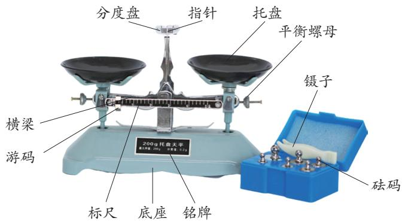

图6-1 托盘天平

要时移动游码，直至指针对准分度盘中央的刻度线。此时，右盘中砝码的 总质量与游码所示质量之和，就等于所测物体的质量。 

使用托盘天平时应当注意： 

1. 待测物体的质量不能超过托盘天平的最大测量值。 

2. 向托盘中加减砝码时，应用镊子轻拿轻放，不可用手直接取砝码。 

3. 托盘天平与砝码应保持干燥、清洁，不得把潮湿的物品或化学药品 直接放在托盘天平的托盘里。 

观察图6-2，指出在使用托盘天平过程中存在的错误。 

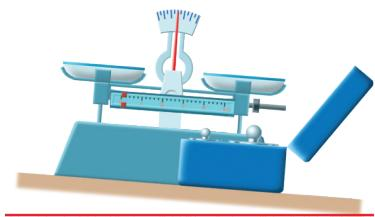

（a）

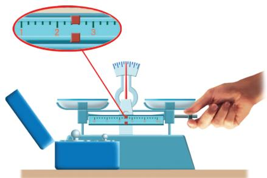

（b）

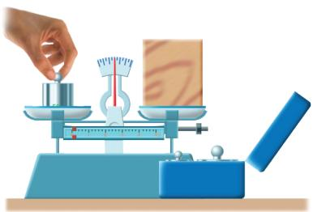

（c）

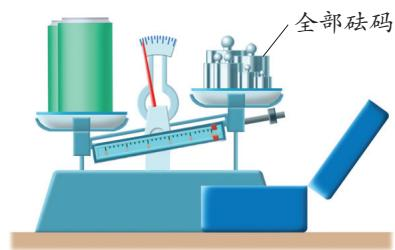

（d）

图6-2 使用托盘天平的错误情形

# 生活 物理 社会 测量质量的几种工具

图 6-3 所示是测量质量的几种常见工具。我国古人很早就开 始用天平、杆秤等工具测量物体的质量。时至今日，一些中药店里 还在使用杆秤。在实验室里，人们用物理天平测量物体的质量，它 的精度比托盘天平高。市场中普遍使用电子秤，它可以显示物品质 量、金额等，操作简单方便。地秤也是电子秤的一种，可以测量像 汽车这样质量较大的物体。 

（a）杆秤

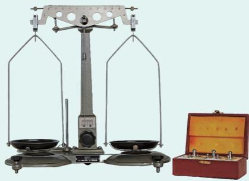

（b）物理天平

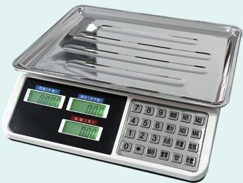

（c）电子秤

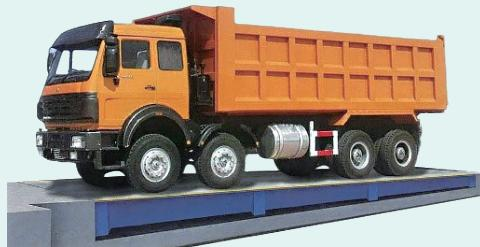

（d）地秤

图6-3 测量质量的几种常见工具

# 学生实验 用托盘天平测量物体的质量

# 实验与记录

1. 把托盘天平放在水平台面上，观察托盘天平的最大测量值和分度值。 

2. 将游码移到标尺左端的“0”刻度线处， 调节平衡螺母使横梁平衡。 

3. 先估计文具盒的质量，再用托盘天平测量。 

4. 如图6-4所示，给你一个空烧杯，如何用托 盘天平测量锥形瓶中水的质量？请实际测一测。 

5. 设法测量一枚回形针的质量，并将测量 结果记录在表格中。 

图6-4 烧杯和锥形瓶

<table><tr><td>实验序号</td><td>回形针的数量/枚</td><td>回形针的总质量/g</td><td>一枚回形针的质量/g</td></tr><tr><td>①</td><td></td><td></td><td></td></tr><tr><td>②</td><td></td><td></td><td></td></tr><tr><td>③</td><td></td><td></td><td></td></tr></table>

# 交流与讨论

1. 用托盘天平测量固体和液 体质量的方法有什么区别？ 

2. 一枚回形针的质量很小，你 认为怎样测量才能使结果更精确？ 

# 方法技巧

当被测物体的质量较小时， 可以先测量多个相同物体的总质 量，再算出一个物体的质量。 

# 质量是物体的属性

# 探究物体形状、物态对质量是否有影响活动 6.1

1. 用天平测量一块橡皮泥的质量，然后把橡皮泥捏成其他形状再测一 次，它的质量改变了吗？ 

2. 把一块冰放入烧杯中，用天平测量它们的总质量。待冰熔化为水后 再测一次，质量改变了吗？ 

由上述活动可知，当物体形状、物态发生改变时，物体的质量不会改 变。研究表明，物体的质量也不随位置改变而改变，如地球上的物体被航 天员带到太空后，质量不变。 

一切物体都有质量，质量是物体的一种属性。 

# 实践与练习

1. 用托盘天平测量物体质量时，指针总是摆来摆去，是否一定要等 它停下来才能判断托盘天平有没有平衡呢？ 

2. 小明将托盘天平放在水平台面上，发现指针偏向分度盘的左侧。 要使托盘天平平衡，应如何调节？他在测量物体质量时，发现指针略偏向 

分度盘的左侧，这时应该如何操 作？当他在托盘天平右盘中放入 $5 0 \mathrm { g } , \ 2 0 \mathrm { g }$ 和 $1 0 \mathrm { g }$ 的砝码各一个， 并将游码移到如图6-5所示的位 置时，托盘天平平衡，被测物体 的质量是多大？ 

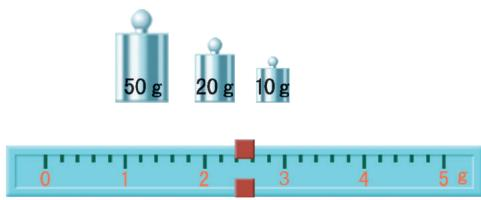

图 6-5

3. 请估计图 6-6 中各对象的质量，然后通过测量或查阅资料标出 其实际质量。 

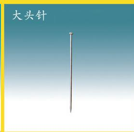

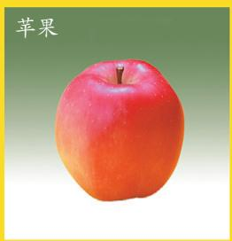

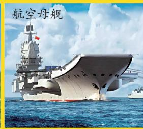

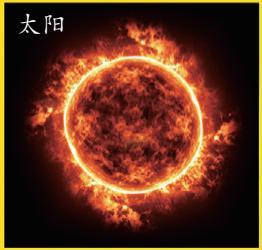

图 6-6

4. 过量摄入食盐对人体健康有害。请你设法测量家里一小勺食盐 有多少克，并查阅资料对你家每日的烹饪用盐量提出建议。 

# 二、密  度

有两个被涂成相同颜色但大小不同的铁块和塑料块，你能区分哪个是 铁块，哪个是塑料块吗？ 

究竟怎样比较，才能区分铁块和塑料块呢？ 

物体的质量与体积之间有什么关系？ 

# 密  度

# 探究质量与体积的关系活动 6.2

# 猜一猜

如图6-7所示，相同的硬币，一枚、两枚……硬币的枚数增加几倍，质 量也就相应地增加几倍。由于每枚硬币的体积相等，因此我们可以推测，硬 币的质量与体积可能成正比。 

由其他物质组成的物体，质量与体积是否也成正比呢？ 

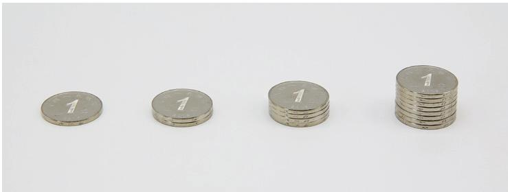

图 6-7 硬币

# 做一做

选择两种不同的物质（如铁和铜），每种物质各选三个体积不等的长 方体。分别测量它们的质量和体积，将测得的数据记录在下表中，并计算 其质量与体积的比。 

<table><tr><td>实验序号</td><td>测量对象</td><td>质量/g</td><td>体积/cm3</td><td>质量/体积/(g·cm-3)</td></tr><tr><td>①</td><td></td><td></td><td></td><td></td></tr><tr><td>②</td><td></td><td></td><td></td><td></td></tr><tr><td>③</td><td></td><td></td><td></td><td></td></tr><tr><td>④</td><td></td><td></td><td></td><td></td></tr><tr><td>⑤</td><td></td><td></td><td></td><td></td></tr><tr><td>⑥</td><td></td><td></td><td></td><td></td></tr></table>

# 议一议

1. 同种物质的不同物体，质量与体积的比是否相等？不同物质的物体， 质量与体积的比是否相等？ 

2. 通过上述比较，你认为质量与体积的比能反映什么问题？ 

研究表明：同种物质的不同物体，质量与体积的比相等；不同物质的 物体，质量与体积的比一般不相等。由此可见，质量与体积之比反映了物 质的一种属性。 

某种物质的物体，其质量与体积之比叫作这种物质的密度（density）， 大小等于单位体积物体的质量。 

通常用 $\rho$ 表示密度，m表示质量，V 表示体积，则密度的公式为 

$$
\rho = \frac {m}{V}
$$

在国际单位制中，质量的单位是千克，体积的单位是米3，则密度的单 位是千克 / 米3，符号为 $\mathrm { k g } / \mathrm { m } ^ { 3 }$ ，读作千克每立方米。密度的常用单位还有 克/厘米3，符号为 $\mathrm { { g } / \mathrm { { c m } ^ { 3 } } }$ 。二者的换算关系是 $\mathrm { ~ 1 ~ g ~ / ~ c m } ^ { 3 } = 1 { \times } 1 0 ^ { 3 } \mathrm { k g } / \mathrm { m } ^ { 3 }$ 。 

# 一些物质的密度

图 6-8 给出了通常情况下一些物质的密度（单位： $\mathrm { k g } / \mathrm { m } ^ { 3 }$ ）。可以看 出，不同物质的密度一般不同，同种物质处于不同状态时密度也不一样。 例如，水和冰是同种物质，但密度不同。 

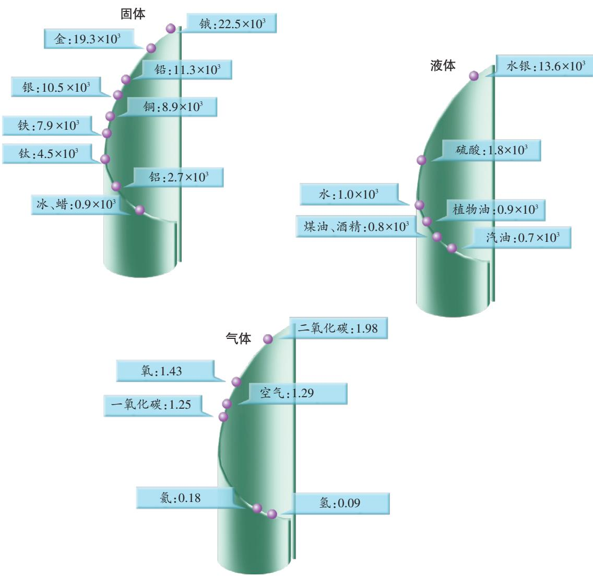

图6-8 一些物质的密度

# 读一读

# 微小差异引起的重大发现

19 世纪末，瑞利（图6-9）发现：由 氨制取的氮气密度是 $1 . 2 5 0 5 \mathrm { k g } / \mathrm { m } ^ { 3 }$ ，而 从空气中提取的氮气密度是 $1 . 2 5 7 2 \mathrm { k g } / \mathrm { m } ^ { 3 }$ ， 前者比后者略小。 

英国化学家拉姆赛在听了瑞利的报告 后提出：从空气中提取的氮气中可能还含 有其他尚未发现的气体。瑞利和拉姆赛一 起反复实验，终于在 1894 年从由空气中 提取的氮气里分离出另一种当时还不为人 知的气体——氩。 

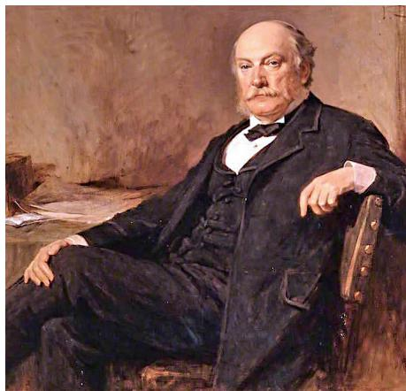

图 6-9 瑞利（John William Rayleigh， 1842—1919），英国物理学家

瑞利不放过实验中的细微差异并执着地研究，最终发现了氩元素，因 而荣获1904年诺贝尔物理学奖。 

# 实践与练习

1. 最多能装5 t水的水箱，能装下5 t汽油吗？请通过计算说明。 

2. 有三个颜色相同但大小不同的实心小球，已知其中有两个小球材 料相同，如何挑出另一个材料不同的小球？ 

3. 某同学用蜡块和干松木块做实验，测得的数据见下表。请在图 6-10 中分别画出蜡块和干松木块的质量与体积关系的图像。根据图 像，你能得出什么结论？ 

<table><tr><td></td><td></td><td></td><td></td><td></td></tr><tr><td>体积 V1/cm3</td><td>质量 m1/g</td><td>体积 V2/cm3</td><td>质量 m2/g</td><td></td></tr><tr><td>①</td><td>2.4</td><td>2.2</td><td>7.2</td><td>4.6</td></tr><tr><td>②</td><td>6.4</td><td>5.8</td><td>8.0</td><td>5.0</td></tr><tr><td>③</td><td>7.3</td><td>6.6</td><td>13.3</td><td>8.4</td></tr><tr><td>④</td><td>8.0</td><td>7.2</td><td>16.5</td><td>10.4</td></tr></table>

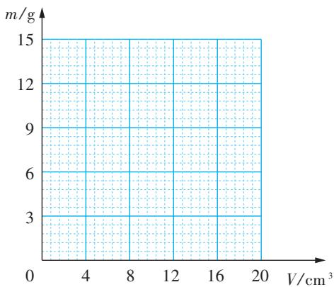

图 6-10

4. 《西游记》中描述了孙悟空使用的武器：“乃是一根铁 柱子，约有斗来粗，二丈有余长……唤作‘如意金箍棒’，重 一万三千五百斤。”若改用现在的国际单位，则该棒的体积约为 $0 . 2 \mathrm { m } ^ { 3 }$ ，质量约为 $6 7 5 0 \mathrm { k g }$ 。你能判断“如意金箍棒”是用什么物 质制成的吗？对于书中的描述，你有什么看法？ 

# 三、密度知识的应用

密度知识在生产、生活中有着广泛的应用，如鉴别物质、测量一些难 以直接测量的物体的质量或体积等。 

# 测量物质的密度

# 学生实验 测量固体和液体的密度

现有一个形状不规则的小石块和一杯食盐水，如何测量它们的密度？ 

# 实验设计

对于形状规则的物体，用天 平测出物体的质量，用刻度尺测 量其尺寸并计算体积，就可以求 出物质的密度了。 

小石块的形状不 规则，食盐水又是液 体，该怎么办呢？ 

# 信息快递

实验室中常用量筒（或量杯）测量液体100 的体积。图 6-11 所示的量筒，其标度的单80 位是毫升（mL）， $1 \mathrm { m L } = 1 \mathrm { c m } ^ { 3 }$ 。 

把量筒放在水平台面上，向其中注入一50 定量的水，读数时视线与水凹面的底部相30 平，即可读出水的体积。 

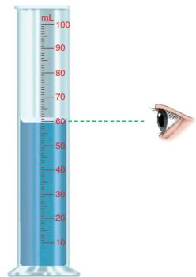

图6-11 量筒的读数

想一想：如何用量筒测量小石块的体积？ 

# 实验与记录

# （一）测量小石块的密度

1. 用天平测出小石块的质量 $m$ 。 

2. 向量筒中注入适量水，读出水的体积 $V _ { 1 }$ ；再用细线系住小石块，将 其浸没在水中，读出水和小石块的总体积 $V _ { 2 }$ 。 

3. 将实验数据记录在表格中，并计算小石块的密度。 

<table><tr><td>质量m/g</td><td>体积V1/mL</td><td>总体积V2/mL</td><td>密度ρ=m/V2-V1/(g·cm-3)</td></tr><tr><td></td><td></td><td></td><td></td></tr></table>

# （二）测量食盐水的密度

仿照上面的实验过程，设计实验方案并进行实验，将实验数据记录在 自己设计的表格中，并计算食盐水的密度。 

# 交流与小结

1.测量固体密度和液体密度的方法有何异同？ 

2. 比较各小组测量食盐水密度的方案，评价其优点和不足。 

# 生活 物理 社会

# 密度计

在生产、生活中，常用密 度计测量液体的密度。图 6-12 （a）所示是玻璃密度计，测量 时，玻璃密度计竖直漂浮在待 测液体中，液面所对应的刻度 值即为该液体的密度值。 

图6-12（b）所示是电子密 度计，它被广泛应用于石油化工、 日用化工和商品检验等领域。 

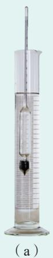

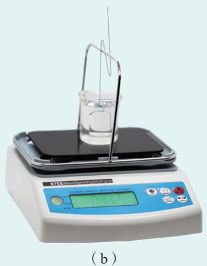

图 6-12 密度计

# 鉴别物质

利用密度知识鉴别物质时，首先要测出样品的密度，再与密度表中的 密度值对比，从而大致判断出物质的种类。例如，地质勘探时，可根据采 集到的矿石样品的密度，初步判断它可能含有何种矿物。由于组成物体的 物质比较复杂，所以在鉴别物质时，除了测量密度，还需结合其他方法。 

除了可以鉴别物质的种类，用测量密度的方法还可以鉴定某些样品是 否合格。例如，可以用测量密度的方法检验医用酒精是否合格。合格医用 酒精的体积分数约为 $7 5 \%$ ，密度约为 $0 . 8 5 \mathrm { g } / \mathrm { c m } ^ { 3 }$ ，若待检样品的含水量偏 大，则密度也会偏大。 

# 间接测量物体的质量或体积

在生产和生活中，我们可以在已知密度和体积的情况下，利用密度公 式 $\rho = \frac { m } { V }$ 计算物体的质量；或者在已知密度和质量的情况下，计算物体的 体积。 

例题　阳山碑材有“天下第一碑”之称。清代著名诗人袁枚在《洪武大 石碑歌》中惊叹：“碑如长剑青天倚，十万骆驼拉不起。”小明到“南京明文 化村（阳山碑材）”景区游玩，看到一块长方体形状的巨大碑身（图6-13右 侧），碑身高 $a = 2 5 \mathrm { m }$ 、宽 $b = 9 . 8 4 \mathrm { m }$ 、厚 $c = 4 \mathrm { m }$ 。他在附近找到一个与碑身 材料相同的小石块，测出其质量为 $5 3 . 2 \mathrm { g }$ ，体积为 $2 0 \mathrm { c m } ^ { 3 }$ 。请你根据这些信 息计算碑身的质量。 

分析　根据高、宽、厚可以计算出碑身的体积。由于碑身材料与小石 块相同，而小石块的密度可以根据测量数据计算出来，因此利用密度公式 就可以求出碑身的质量。 

解答　小石块的质量 $m _ { 1 } = 5 3 . 2 \ \mathrm { g }$ ，体积 $V _ { \mathrm { 1 } } = 2 0 ~ \mathrm { c m } ^ { 3 }$ ，小石块的密度 

$$
\rho = \frac {m _ {1}}{V _ {1}} = \frac {5 3 . 2 \mathrm {g}}{2 0 \mathrm {c m} ^ {3}} = 2. 6 6 \mathrm {g} / \mathrm {c m} ^ {3} = 2. 6 6 \times 1 0 ^ {3} \mathrm {k g} / \mathrm {m} ^ {3}
$$

碑身的体积 

$$
V = a b c = 2 5 \mathrm {m} \times 9. 8 4 \mathrm {m} \times 4 \mathrm {m} = 9. 8 4 \times 1 0 ^ {2} \mathrm {m} ^ {3}
$$

碑身与小石块密度相等，由密度公式 $\rho = \frac { m } { V }$ 可知 

$$
\begin{array}{l} m = \rho V \\ = 2. 6 6 \times 1 0 ^ {3} \mathrm {k g / m ^ {3}} \times 9. 8 4 \times 1 0 ^ {2} \mathrm {m ^ {3}} \\ \approx 2. 6 \times 1 0 ^ {6} \mathrm {k g} \\ = 2. 6 \times 1 0 ^ {3} t \\ \end{array}
$$

反思　如果有一个与碑身材料相同的形状不规则的小石块，如何用天平 “测”它的体积？ 

# 实践与练习

1. 小明要测量某种矿石的密度，他先用天平测量矿石的质量，当天 平平衡时，右盘中的砝码和游码在标尺上的位置如图6-14（a）所示； 然后用量筒和水测量矿石的体积，测量过程如图6-14（b）所示。请根 

据上述信息，求矿石的密度。 

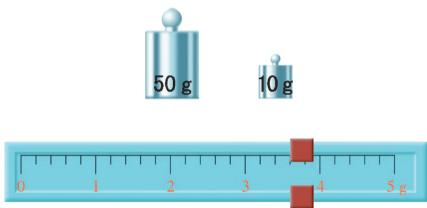

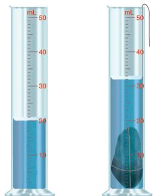

图 6-14

2. 如图6-15所示，有一捆横截面积为 $2 . 5 \mathrm { m m } ^ { 2 }$ 的铜丝，质量为 $8 . 9 \mathrm { k g }$ ，试计算铜丝的长度。 

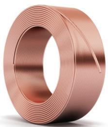

图 6-15

3. 劳动课上，老师要求全班同学每人制作一把小钉锤，锤体用横截 面为 $2 0 \mathrm { m m } \times 2 0 \mathrm { m m }$ 、长度为 $6 0 \mathrm { m m }$ 的方钢制作。若全班共有40人，则 至少需要方钢多少千克？（设 $\rho _ { \mathrm { \# \# } } = 7 . 8 5 ~ \mathrm { g / c m } ^ { 3 }$ ） 

4. 小明到江南古镇旅游时发现，某店铺用竹筒量取米酒、酱油 等。如图 6-16 所示，两竹筒内径相等，竹筒 A 用来量取米酒，竹筒 B 用来量取酱油，当它们都盛满时，竹筒 A 中米酒和竹筒 B 中酱油 的质量相等。已知米酒密度为 $\rho _ { \ast \ ; \ast \natural } = 0 . 9 5 \times 1 0 ^ { 3 } \mathrm { k g } / \mathrm { m } ^ { 3 }$ ，酱油密度为 $\rho _ { \frac { * } { 9 } ; \updownarrow \hslash } = 1 . 1 5 \times 1 0 ^ { 3 } \mathrm { k g } / \mathrm { m } ^ { 3 }$ ，求竹筒A与竹筒B筒身的高度之比。 

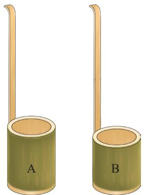

图 6-16

# 四、物质的物理属性

不同物质的物理属性一般不同。物质的物理属性有许多种，如沸点、 密度等。了解物质的物理属性，对于生产、生活的许多方面都具有重要 意义。 

# 一些物质的物理属性

观察图 6-17，分别指出各场景中标注的物体所反映的物理属性。 

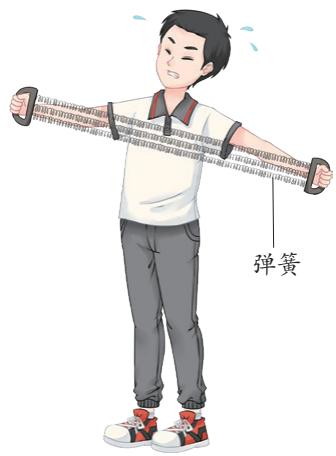

（a）拉力器上的弹簧

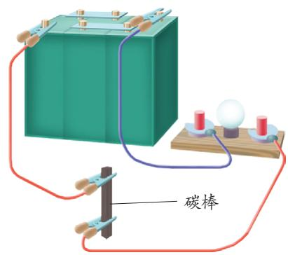

（b）连接在电路中的碳棒

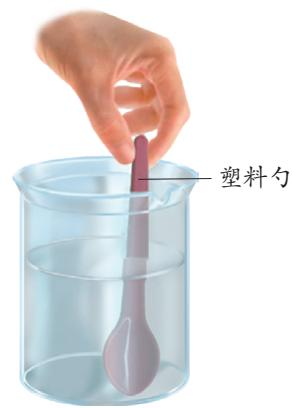

（c）放在热水中的塑料勺

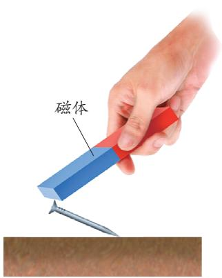

（d）能吸引铁钉的磁体

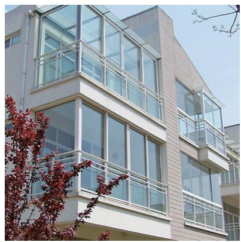

（e）阳台窗户的玻璃

图6-17 不同物质的物理属性

在生产、生活中，我们用硬度较大的金刚石制成玻璃刀，可以轻松切 割玻璃；用导热性较差的塑料制成铁锅的把手，可以防止烫手；用延展性 

较好的金和银，可以塑造各种精美的饰品；用具有特殊导电性能的半导体 材料，可以制成各种电子元器件……这些应用都跟物质的物理属性相关。 你还能列举出一些与日常生活有关的利用物质物理属性的例子吗？ 

# 比较钢勺与瓷勺的导热性活动 6.3

# 做一做

1. 将钢勺和瓷勺的勺头一起放入盛有开水的烧 杯中，过一会儿，用手触摸两个勺子的勺柄，你的 感受是怎样的？ 

2. 如图 6-18 所示，将瓷勺的勺头放在酒精灯 火焰上加热一段时间，然后与火柴头接触，火柴被 点燃。 

身体不要接触 勺头，防止烫伤！ 

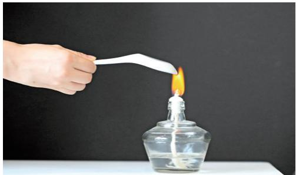

（a）加热瓷勺

（b）瓷勺点燃火柴

图6-18 感受瓷勺的导热性

# 说一说

为什么钢勺的勺柄烫手，而瓷勺的勺柄不烫手？这反映了钢和瓷两种物质 的哪一种物理属性不同？ 

上述活动中，勺头温度较高，会 向低温部分导热，由于瓷的导热性比 钢差，因此瓷勺勺柄的温度上升较慢。 图 6-19 是用红外成像技术拍摄的加热 后瓷勺的红外照片，从图中各区域的 颜色不同可以看出，勺头温度很高， 而勺柄温度较低。 

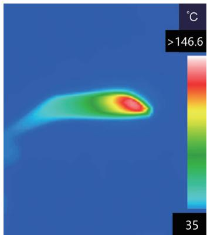

图6-19 瓷勺的红外照片

# 物质的物理属性与新材料

材料是经济建设、国防建设和人民生活所不可缺少的物质基础。从最 早的泥土、岩石开始，到青铜，再到铁和钢，每一种新材料的发现、发明 和应用，都会把人类利用自然和改造自然的能力提高到新的水平，从而给 社会生产力和人类生活带来巨大变化。 

人类对物质物理属性的研究，推动了材料科学与技术的发展。人们对半 导体导电性的研究，导致了晶体管的诞生，进而促进了各种半导体器件的发 明，如集成电路、激光器、传感器等，加快了人类社会步入信息化时代的步 伐；对锂电池正负极材料的研究，使得锂电池的安全性、寿命、能量密度等 不断提高，促进了新能源汽车产业的跨越式发展。我国科研人员坚持不懈地 

对材料硬度、耐磨性能进行研究，解 决了盾构掘进机机头（图6-20）的关 键部件—刀具的制造难题，打破了 国外的技术封锁，实现了关键技术 的自主可控。该技术的应用，显著 提高了隧道掘进的速度与质量，为 我国交通建设事业的高速发展提供 了基础性保障。 

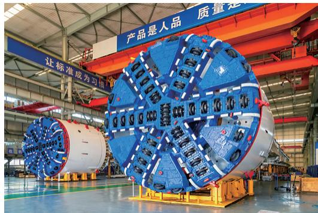

图6-20 我国自主研制的盾构掘进机机头

# 生活 物理 社会

# 航天器的特殊“外衣”

航天器在穿越大气层返回地球时，与空气剧烈摩擦，外壳温度 高达几千摄氏度。怎样才能使航天器安全返回呢？ 

20 世纪中叶，航天技术专家用新型陶瓷制成防热瓦安装在航 天器的外表面。这种陶瓷不仅具有耐高温、耐磨损、耐腐蚀和隔 热性好等优点，而且还克服了传统陶瓷易碎的弱点，从而能很好 地保护航天器。新型陶瓷的应用并不是一帆风顺的，有时甚至付 出了沉重的代价。2003 年 1 月 16 日，美国“哥伦比亚号”航天 飞机起飞时，脱落的泡沫材料撞击航天飞机左翼的隔热层，造成 

防热瓦出现裂缝，导致“哥伦比亚号”在 2003 年 2 月 1 日重返大 气层时，因超高温气流乘虚而入而解体，七名航天员全部遇难， 这是人类探索太空事业的重大损失。 

我国的“神舟”系列飞船表面涂有一层烧蚀材料，它在高温、 高压气流冲刷下发生热解，在熔化、汽化、升华等过程中吸收并 带走大量热量，从而达到保护航天器的目的。图 6-21 是我国“神 舟”载人飞船返回舱成功返回地球的照片。它的不同部位采用了多 种不同的烧蚀材料。例如，侧壁表面采用的是超轻质蜂窝增强防热 材料，其密度约为 $0 . 3 6 \times 1 0 ^ { 3 } \mathrm { k g } / \mathrm { m } ^ { 3 }$ 。目前，我国航天器的防护， 无论是材料还是技术研究，都已处于国际领先水平。 

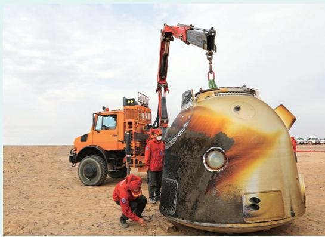

图6-21 “神舟”载人飞船返回舱

# 实践与练习

1. 图 6-22 所示是生活中 一些常见的物品，请从中选 择几个，说明它们所用的主 要材料，以及这些材料的主 要物理属性。 

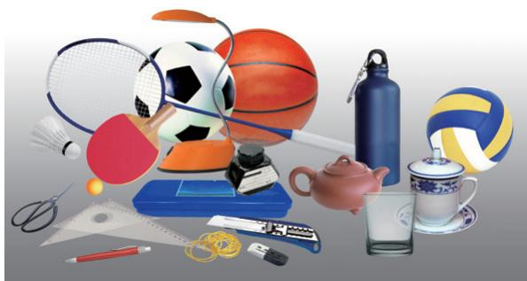

图 6-22

2. 黄金有较好的延展性， 可以锻制成薄如蝉翼的金箔。 图 6-23 所示是金箔被羽毛轻松 吸起的情景。南京金箔锻制技艺 是我国第一批国家级非物质文化 遗产。现有一块面积为 $0 . 5 \mathrm { m } ^ { 2 }$ 、 厚度为 $4 \mathrm { m m }$ 的金板，它的质量 是多少克？若将其锻制成厚度为 $0 . 1 \mu \mathrm { m }$ 的金箔，面积是原来的多 少倍？ 

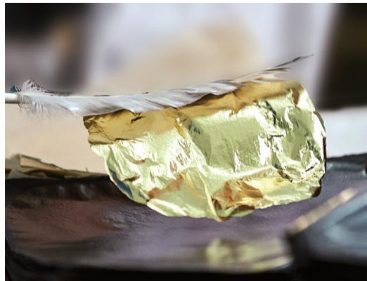

图 6-23

3. 图 6-24 所示是常见的铅笔芯、钢尺、粉笔、铜钥匙、铁钉。 请设计一个简单的实验，比较它们的硬度，并将它们按硬度从大到小 的顺序排列。 

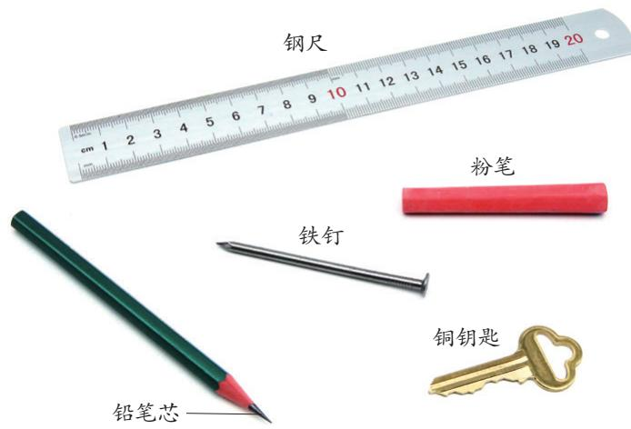

图 6-24

做实验时，不 要损坏公物，注意 不要被实验材料的 边角或尖端划伤。 

# 跨学科实践

# 设计制作保温盒

生活中经常要用保温瓶、保温杯、保温盒、保温箱等方便携带或运 输的保温器具。例如，快餐配送时需要使用保温箱，使热食维持较高温 度，使冷食维持较低温度。 

保温盒为什么能保温？如何提高它的保温性能？我们可以利用身 边的器材进行探究。 

# 任务与要求

1. 图 6-25 所示是一些便携式保温器具，请通过观察和查阅资料等 途径，了解它们的结构特点、材料种类和保温性能。 

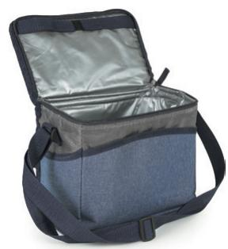

（a）保温袋

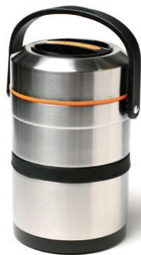

（b）保温桶

（c）保温箱

图6-25 便携式保温器具

图 6-26 所示是生活中常见的玻璃杯。这种玻璃 杯倒入开水后外壁不烫手，且有较好的保温性能。为 什么会有这些优点？有人认为是由于它的玻璃壁很 厚，传热比较慢。但仔细观察就会发现，它是双层 的，且每层玻璃壁均较薄。这种玻璃杯通常被称为 “双层真空玻璃杯”。它的哪一部分是真空的？这是 它具有上述优点的原因吗？观察其他保温器具是否也 具有类似的构造。 

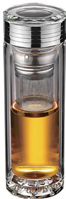

图6-26 隔热玻璃杯

2.设计方案。首先要明确保温盒用途、保温指标以及运输方式。在 材料选择与结构设计上，除了要考虑保温性能，还要考虑抗压、减震、 防水等方面的要求。设计用于冷藏物品的保温盒时，除了要考虑提高保 温性能，还要考虑利用低温物品来提升冷藏效果等。 

3.根据设计方案进行模拟实验。比较不同材料（如木材、铝材、泡 沫塑料、瓦楞纸等）的保温性能，比较不同结构以及物品在盒内的不同 放置方式对保温性能的影响，比较不同低温物品的制冷效果等。 

4. 根据模拟实验的结果，修改方案并进行制作。 

5. 检验所制作的保温盒是否达到设计要求，并写出报告。 

# 交流与评价

1. 展示作品，分享实验报告，交流设计和制作过程中的心得体会。 

2. 从保温效果和设计的合理性、创新性，以及制作工艺等方面 进行评价。 

3. 从环保和节约资源等角度出发，在方案设计和材料选择等方面提 出改进建议。 

# 内容梳理

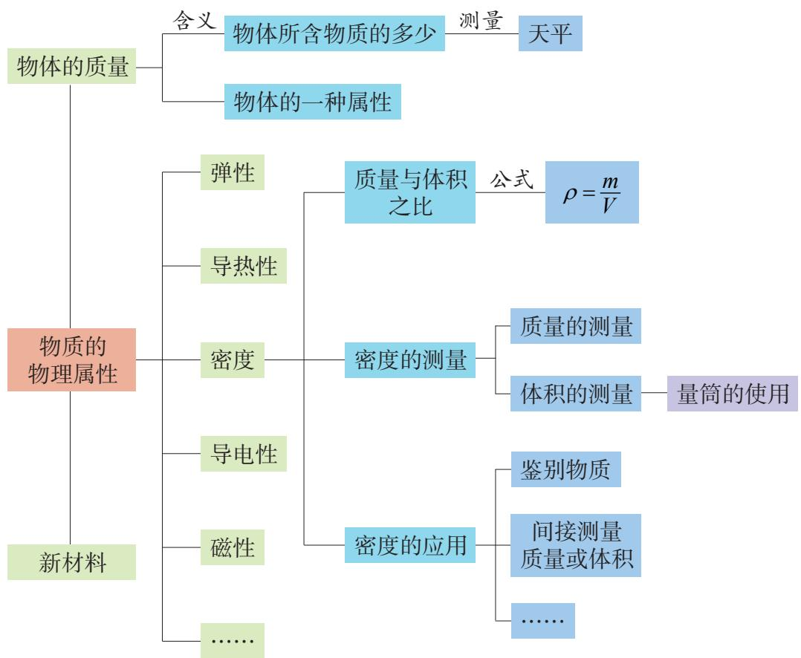

# 反思提升

1. 请从物体质量含义的角度，说明为什么物体质量不随形状、物 质状态、所处位置的变化而变化。 

2. 生活中，人们常说“铁比棉花重”。这句话应该如何理解才正 确？在物理学中，其正确的表述是什么？ 

3. 在人口调查中，城市人口密度是数据分析的内容之一；在农业 生产中，种植密度是影响作物生长和产量的重要因素之一。上述两种 情况所提到的“密度”，与物质的密度有何异同？试从定义、计算公 式和单位三个方面进行比较。 

4. 质量与体积之比反映了物质的一种属性，与质量和体积无关。 我们应该如何理解这一说法？ 

# 问题解决

1. 为了响应“低碳生活，绿色 出行”倡议，越来越多的人使用共 享单车（图 6-27）。参考图 6-28 所示卡片中已填写的内容，将自行 车其他部件的名称、材料和主要物 理属性填入卡片中。 

想一想：在使用共享单车时， 我们应该怎么做才能更好地履行社 会责任？ 

图 6-27

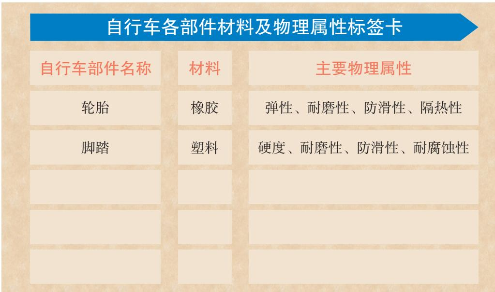

图 6-28

2. 测量小石块密度时，需要向量筒中注入 适量水（图 6-29）。怎么理解“适量”？如果100 mL 要测量漂浮在水面上的物体的体积，可以采用80 什么方法？ 

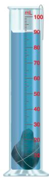

图 6-29

3.为了测量酸奶的密度，某小组同学制订了两种测量方案： 

方案一： $\textcircled{1}$ 用天平测出空烧杯的质量； $\textcircled{2}$ 向烧杯中倒入适量酸 奶，用天平测出烧杯和酸奶的总质量； $\textcircled{3}$ 将烧杯中的酸奶倒入量筒， 读出体积； $\textcircled{4}$ 计算酸奶密度。 

方案二： $\textcircled{1}$ 向烧杯中倒入适量酸奶，用天平测出烧杯和酸奶的总质 量； $\textcircled{2}$ 将烧杯中的部分酸奶倒入量筒，读出这部分酸奶的体积； $\textcircled{3}$ 用天 平测出烧杯和剩余酸奶的总质量； $\textcircled{4}$ 计算酸奶密度。 

从准确测量的角度考虑，哪种方案更好？请说明理由。 

# 联系宇宙万物的纽带

# 力

# 第七章

力　弹力 

重力　力的示意图 

? 摩 擦 力 

力的作用是相互的 

短跑运动员为什么要用起跑器？ 

掷出的铅球为什么会落向地面？ 

拔河比赛时为什么要握紧绳索？ 

这一切都与“力”有关。 

力存在于日常生活中，也存在于宇宙万物之间。 

# 一、力　弹力

# 力是什么

有人认为，力是由肌肉紧张引起的，只有人和动物才能产生力。这种 认识对吗？ 

如图 7-1 所示，人可以举起重物，铲车也能举起重物；狗可以拉动雪 橇，火车头也能拉动车厢。 

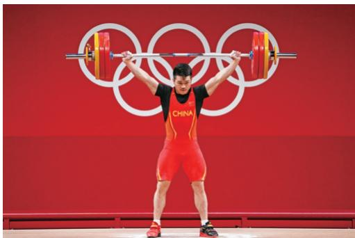

（a）运动员举起杠铃

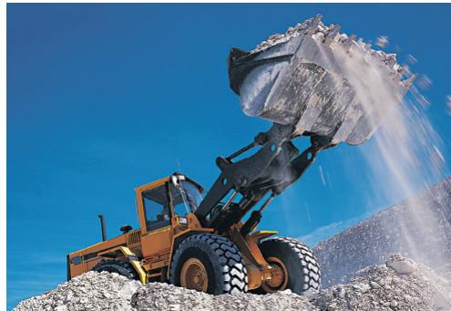

（b）铲车举起重物

（c）狗拉雪橇

（d）火车头拉车厢

图 7-1 力

你能否举出更多例子，说明物体对物体也可以产生类似举、拉、压、 推等作用？ 

物理学中，把物体对物体的作用称为力（force），用字母 $F$ 表示。力 的作用总是涉及两个物体：一个是施加力的物体，叫作施力物体；另一个 是受到力的物体，叫作受力物体。 

在图7-1所示的实例中，哪些物体是施力物体，哪些物体是受力物体？ 

# 形变和弹力

如图 7-2 所示，手压气球，气球变扁；手压塑料尺，塑料尺变弯；手 拉弹簧，弹簧伸长。由此可见，力会使物体的形状发生改变。物体形状的 改变叫作形变。如果形变物体在撤去外力后能恢复原状，那么该物体所发 生的这种形变叫作弹性形变。 

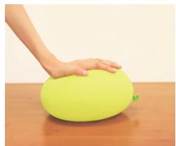

（a）手压气球

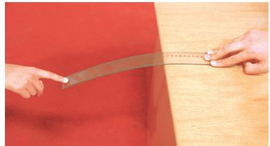

（b）手压塑料尺

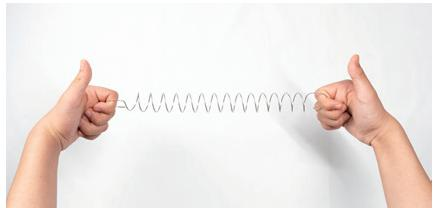

（c）手拉弹簧

图7-2 力使物体发生形变

实际试一试，你会发现，手施加的力越大，气球、塑料尺和弹簧的形 变就越大。同时，你会感到它们对手也有力的作用，这是因为它们在发生 弹性形变时，会力图恢复原来的形状，从而对手产生力的作用。我们把形 变物体力图恢复原状，而对另一个物体产生的力叫作弹力（elastic force）。 

# 力的测量

力是有大小的。人们根据弹性形变与外力的关系，制成了弹簧测力计， 可以用它来测量力的大小。图7-3所示是几种常见的测力计。 

在国际单位制中，力的单位是牛顿，简称牛，符号为 N。生活中，用 手托住两个鸡蛋所用的力约为 $1 \mathrm { N }$ 。 

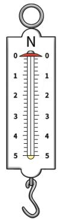

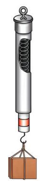

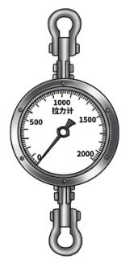

图7-3 几种测力计

# 学生实验 练习使用弹簧测力计

# 看一看

如图 7-4 所示，观察弹簧 测力计，了解它的结构、量程 和分度值。 

阅读弹簧测力计使用注意 事项，议一议：图 7-5 所示的 操作中，哪一个是正确的？其 余的错在哪里？ 

图7-4 弹簧测力计外观和内部结构

（b）

图7-5 弹簧测力计的使用

# 信息快递

# 弹簧测力计使用注意事项

1. 选择弹簧测力计时，应先 了解它的量程和分度值，所测力 的大小应在它的量程内。 

2. 测量前，应检查指针是否指 在“0”刻度线处。若不在，应校 正“0”点。 

3. 测量时，应使弹簧测力计中 弹簧的轴线方向与受力方向一致。 

4. 读数时，视线应与刻度板 垂直。 

# 做一做

1. 将弹簧测力计竖直放置，观察并校正“0”点。 

2. 用手向下拉弹簧测力计的挂钩，体验并比较弹簧测力计示数为 1 N 和 5 N 时手的感觉。 

3. 将一个钩码和两个钩码先后挂在弹簧测力计的挂钩上，分别读出弹 簧测力计的示数。 

# 生活 物理 社会

# 发生弹性形变的物体具有能量

运动的物体具有能量，发生弹性形变的物体也具有能量吗？图 7-6所示的情景说明了什么？ 

（a）人被形变的撑竿弹起来

（b）人被弯曲的跳板弹起来

（c）箭被拉开的弓射出去

（d）人被形变的蹦床弹起来

图7-6 发生弹性形变的物体

生活中还有许多事实说明，发生弹性形变的物体具有能量，这 种能量叫作弹性势能。 

# 实践与练习

1. 观察生活中利用弹力工作的物品， 并以其中一件为例简要说明其工作过程。 

2. 如图7-7所示，用橡皮筋、回形针、棉 线、小瓶盖、牙膏盒、铁丝和刻度尺等，做一个 橡皮筋测力计。想一想：怎样标注它的刻度？ 

图 7-7

# 二、重力 力的示意图

# 重力的大小和方向

如图 7-8 所示，水为什么会流向低处？跳伞的人为什么会落向地面？ 抛出的套圈为什么会下落？ 

（a）山间瀑布

（b）高空跳伞

（c）套圈游戏

图 7-8 重力

图7-9 测量物体所受的重力

原来，地球上的一切物体都受到地球的吸引。 物体由于地球吸引而受到的力叫作重力（gravity）， 用字母 $G$ 表示。 

生活中，常把物体所受重力的大小简称为物重。 

物体所受的重力可以用弹簧测力计测量，如图 7-9 所示。 

# 活动 7.1 探究重力与质量的关系

# 试一试

提起质量不等的物体，你手臂的感 觉有何不同？这是为什么？ 

如图 7-10 所示，三个质量相同的钩 码，它们的总质量是其中一个的 3 倍。 那么，三个钩码的总重是否也是其中一 个的3倍？用弹簧测力计测一测。 

图7-10 探究重力大小与质量的关系

# 猜一猜

你认为物体所受的重力与它的质量有什么关系？ 

# 做一做

用天平、弹簧测力计分别测量三个小物体（如钢笔、苹果、橡皮）的 质量和所受的重力，将结果记录在下表中。 

<table><tr><td>实验序号</td><td>物体名称</td><td>质量m/kg</td><td>重力G/N</td></tr><tr><td>①</td><td></td><td></td><td></td></tr><tr><td>②</td><td></td><td></td><td></td></tr><tr><td>③</td><td></td><td></td><td></td></tr></table>

# 议一议

计算各物体所受的重力与它的质量之比 $( \ { \frac { G } { m } } \ )$ ，其结果有何特点？这 说明物体所受的重力与它的质量有什么关系？ 

实验表明，物体所受的重力与它的质量成正比。物体所受的重力与它 的质量之比通常用 $g$ 表示，即 $g = { \frac { G } { m } }$ ，因此物体所受的重力与其质量的关系 可以写成 

$$
G = m g
$$

公式中质量的单位是千克 $( \mathrm { { k g } ) }$ ），力的单位是牛（N），g 约等于 $9 . 8 \mathrm { N } / \mathrm { k g }$ 。在粗略计算中， $g$ 可以取 $1 0 \mathrm { N / k g }$ 。 

# 第七章  力

例题　一位八年级男同学的质量是 $5 0 \mathrm { k g }$ ，他所受的重力是多少牛（g 取 $1 0 \mathrm { N / k g }$ ）？ 

分析　已知质量，根据重力与质量的关系可以计算该同学所受的重力。 

解答　该同学所受的重力 

$$
G = m g = 5 0 \mathrm {k g} \times 1 0 \mathrm {N} / \mathrm {k g} = 5 0 0 \mathrm {N}
$$

反思　如果已知某物体质量的单位为克，那么计算该物体所受的重力 时要注意什么？ 

# 判断重力的方向活动 7.2

猜一猜 

物体所受重力的方向是怎样的？ 

试一试 

用图7-11所示的器材进行实验。 

缓慢改变支架底座的倾角 $\alpha$ ，观察悬线OA的 方向是否变化。判断悬线 $O A$ 与水平面之间的关系。 

由实验可知，重力的方向是竖直向下的。 

图7-11 判断重力的方向

# 信息快递

竖直方向就是与水 平面垂直的方向。 

# 力的示意图

物理学中，通常把力的大小、方向和作用点称为 力的三要素。用带箭头的线段来表示物体所受的力， 这样的图称为力的示意图。例如，一个球体所受重力为 $1 0 \mathrm { N }$ ，可以用竖直向下带箭头的线段表示。如图7-12所 示，箭头表示重力的方向；在箭头旁标注“ $G { = } 1 0 \mathrm { N } ^ { \prime }$ ”， 表示重力的大小；线段的起点在球心处，表示重力的作 用点，即物体的重心（center of gravity）。 

图7-12 重力的示意图

# 信息快递

物体的每一部分都受到重力作用。对于整个物体，重力的作用等效于集中 在一个点上，这一点叫作物体的重心。 

如果要在图中画出物体受到的几个力，除了要画出各个力的作用点和方 向，还应当用线段的长短粗略地区分力的大小。 

例题　如图 7-13 所示，小华拉着箱子行走，拉杆对箱子的拉力为 $2 0 ~ \mathrm { N }$ ，拉力方向与水平面成 $4 5 ^ { \circ }$ °角。试画出箱子所受拉力的示意图。 

分析 力的示意图要能反映力的三要素。可用简图（如方框）表示箱子， 取拉杆与箱体连接处为力的作用点，从该点沿与水平面成 $4 5 ^ { \circ }$ °角的方向画一条 带箭头的线段，并标注力的大小。 

解答 如图 7-14 所示，图中点 $O$ 为力的作用点，线段的长度反映力的 大小，箭头和标注的 $4 5 ^ { \circ }$ °反映力的方向。 

图 7-13

图 7-14

# 生活 物理 社会

# 高处的物体具有能量

如图 7-15 所示，从高处流下的水能带动水轮发电机发电， 从高处落下的重锤能夯实地基。事实表明，被举高的物体具有能 量，这种能量叫作重力势能。重力势能和弹性势能是常见的两种 势能（potential energy） 

（a）

（b）

图7-15 高处的物体具有重力势能

# 实践与练习

1. 铅垂线在生产和生活中有广 泛的应用。图 7-16 中的铅垂线各 有什么作用？用身边的物品自制铅 垂线，并试着用它检验墙体、门框 等是否竖直。 

图 7-16

2. 用弹簧测力计测得一个物体重 $4 . 9 \mathrm { N }$ ，该物体的质量是多少克？ 

3. 试一试，按如图7-17所示的三种方法关门，哪一种方法最省力？ 哪一种方法不能将门关上？这说明力的作用效果与哪些因素有关？ 

图 7-17

图 7-18

4. 如图 7-18 所示，小明沿与地面成 $3 0 ^ { \circ }$ °角的 滑道下滑。滑道对他的支持力为 $3 0 0 \mathrm { N }$ ，力的方向 与滑道垂直。请画出这个力的示意图。提示：可以 在原图上画，也可用方框表示人体另外作图。 

5. 如图 7-19 所示，生活在南半球的人会从地 球上掉出去吗？为什么？ 

若地球上的物体所受的重力突然消失，将会出 现什么情景？将你设想的情景与同学交流。 

图 7-19

# 三、摩 擦 力

行驶的汽车刹车后，为什么能很快停下来？用二胡、提琴等乐器演奏乐 曲时，为什么要在琴弓的弓毛上涂抹松香？这些都和两个物体接触面间的摩 擦力（friction force）有关。 

# 滑动摩擦力

如图7-20所示，在桌面上匀速拉动木块时，你会感到桌面对木块有阻碍吗？ 

图7-20 拉动木块

一个物体在另一个物体表面上滑动时，会受到阻碍它运动的力，这种 力叫作滑动摩擦力。 

# 学生实验 探究影响滑动摩擦力大小的因素

# 猜想与设计

1. 将手掌按在桌面上并滑动，体验 手受到的阻力。加大手掌对桌面的压力 后再滑动，与前一次相比，手受到的阻 力有什么变化？ 

2. 根据上述体验，你认为影响滑动 摩擦力大小的因素可能有哪些？日常生 活中有哪些经验支持你的猜想？ 

3. 要通过实验来验证猜想，必须解决下列问题：怎样测量滑动摩擦力 的大小？怎样改变接触面的粗糙程度？怎样改变接触面间的压力？ 

4. 请根据实验方案，设计实验数据记录表。 

# 信息快递

用弹簧测力计沿水平方 向拉动水平面上的物体做匀 速直线运动时，弹簧测力计 的示数就等于物体所受摩擦 力的大小。物体对水平面的 压力等于物体所受的重力。 

# 第七章  力

# 实验与记录

1. 如图 7-21 所示，将木块 放在水平木板上，用弹簧测力 计水平拉动木块，使它沿木板 做匀速直线运动，读出弹簧测 力计的示数，并将数据记录在 自己设计的表格中。 

图7-21 探究影响滑动摩擦力大小的因素

2. 在木块上放置钩码，改 变木块对木板的压力，重复步骤 1。 

3. 改变接触面的粗糙程度，重复步骤1。 

# 交流与小结

分析实验数据，你得到什么结论？ 

# 实验拓展

该实验还可用数字化实验装置进行。如图7-22所示，将智能电机、智能 小车组装起来与摩擦块一起放在水平轨道上，启动智能小车，小车拉动摩擦块 匀速运动。由智能小车内置的力传感器对滑动摩擦力的大小进行测量，实时采 集的数据经计算机处理和分析后，最终以数值或图像的形式在计算机屏幕上呈 现出来。实验中，可以通过增减摩擦块上的配重来改变压力大小，也可以通过 更换粗糙程度不同的摩擦面来改变接触面的粗糙程度。 

图7-22 用数字化实验装置探究影响滑动摩擦力大小的因素

大量实验表明，滑动摩擦力的大小与接触面的粗糙程度、压力的大小 有关，接触面越粗糙、压力越大，滑动摩擦力就越大。 

# 增大或减小摩擦的方法

在日常生活中，摩擦现象普遍存在。有些摩擦对人们的生活有益，需 要设法增大；有些摩擦对人们的生活不利甚至有害，应该设法减小。在图 7-23 所示的这些实例中，人们是怎样增大或减小摩擦的？你还能举出哪些 增大或减小摩擦的实例？ 

（a）鞋底的槽纹

（b）在自行车链条上加润滑油

（c）运动员在手上涂镁粉

（d）自行车的刹车装置

图7-23 增大或减小摩擦

# 活动 7.3 将滑动变为滚动

把一本较厚的书放在桌面上，用 一根橡皮筋拉动它匀速前进。然后在 书和桌面间垫几支圆柱形的铅笔，再 拉动它匀速前进，如图 7-24 所示。根 据橡皮筋伸长的长度变化，你能得出 什么结论？ 

图7-24 将滑动变为滚动

研究表明，除了减小接触面间的压力、接触面的粗糙程度，还可以采 用加润滑油、变滑动为滚动等方法减小物体间的摩擦。 

# 生活 物理 社会 减小阻力的智慧

在交通工具发展的历程中，减小阻力一直是重要的技术创新课 题。早在几千年前，我们的祖先就曾用滚木移动巨石，以滚动代替 滑动，从而减小阻力，如图 7-25 所示。后来，滚木演变为轮子， 被安装在战车上，如图 7-26 所示。随着科学技术的发展，各种各 样的车辆层出不穷，车轮技术也在不断创新。 

图7-25 利用滚木移动巨石

图7-26 秦陵一号铜车马

人们还发现，使车、船与支持面脱离接触能更好地减小阻力， 由此发明了磁悬浮列车和气垫船（图 7-27）。为了减小车、船在 空气或水中的阻力，人们还仿照海洋中擅长游泳的动物的体形，设 

计了流线型的交通运输工具，如小轿车、高速列车（图 7-28）以 及潜艇等。 

图 7-27 气垫船

图 7-28 高速列车

# 实践与练习

1. 下列措施中，哪些是为了增大摩擦，哪些是为了减小摩擦？分别 是如何增大或减小摩擦的？ 

（1）汽车在结冰的路面行驶时，在车轮上缠绕铁链。 

（2）用力压住橡皮，擦去写错的字。 

（3）移动很重的石块时，在地上铺设滚木。 

（4）在衣服的拉链上涂蜡。 

2. 观察自行车（图 7-29）的各个 部分，分析它在哪些地方、采用何种方 法增大了有益摩擦，在哪些地方、采用 何种方法减小了有害摩擦。 

图 7-29

# 四、力的作用是相互的

力是物体对物体的作用。当施力物体对受力物体施加力的作用时，施力 物体是否也同时受到力的作用呢？ 

拳击运动员主动出击，对 手被打倒，这说明只有对手才 受到力的作用。 

飞来的足球被头顶了出 去，头也很疼，这说明足球 受力的同时，头也受到了力 的作用。 

你的观点是什么？你能列举实例来佐证吗？ 

# 物体在施力的同时是否也受力活动 7.4

# 试一试

1. 如图7-30所示，用手指压铅笔尖，手指有什么感觉？ 

2. 如图 7-31 所示，小明和小华穿着轮滑鞋静止在地面上。如果小华用 力推小明，会发生什么现象？ 

图7-30 手指有什么感觉

图7-31 小华还能保持静止吗

3. 如图 7-32 所示，将固定有磁体的小车向固定有铁块的小车靠近，至 一定距离后松手，你观察到什么现象？ 

图7-32 铁块对磁体的作用

讨论与交流 

上述活动中观察到的现象能说明什么问题？ 

大量事实说明，一个物体对另一个物体有力的作用时，另一个物体也 同时对这个物体有力的作用，即物体间力的作用是相互的。 

# 读一读

# 奇思妙想

小明梦见他和小华乘坐的小船停在非常光滑的冰面上，他们无法推动 小船。小明急中生智，他和小华一起把行李向船的后方扔去，这时小船居 然向前运动了，如图7-33所示。 

后来，小明把自己的梦告诉科学家爷爷。爷爷肯定了他的奇思妙想， 并且告诉他，帮助人们实现飞天梦想的火箭正是应用了这一原理。火箭喷 出高温、高压气体，同时这种气体也对火箭施加了强大的推动力。 

图7-33 小明梦境中的奇思妙想

# 实践与练习

1. 排球运动员扣球时，会感到手部疼痛，这是为什么？手受到的力 是什么物体施加的？ 

2. 如图 7-34 所示，悬停在空中 的直升机受到哪几个力的作用？施力 物体分别是什么？它们是否受到直升 机的作用力？ 

图 7-34

3. 图 7-35 所示是小明游泳时的情景。请说明他的身体能够向前 运动的原因。 

图 7-35

# 内容梳理

# 反思提升

1. 从一些经验事实中找出事物的共同特征，从而概括出一般性原 理或结论的思维方法称为归纳。结合本章内容，说出哪些原理或结论 是通过归纳得到的。 

2. 物体静止在水平地面上，地面对物体底部 各处都有支持力。为什么支持力的示意图可以像 图 7-36 那样画？请结合重力示意图的画法，说 说你对力的作用点的认识。 

图 7-36

3. 在探究重力与质量的关系时，分别测量了不同物体的质量和所受 的重力。除了用重力与质量之比来分析，还可以怎样分析数据，得出 “物体所受的重力与它的质量成正比”的结论？ 

4. 人走路时，鞋子与地面间存在摩擦，会磨损鞋子，但摩擦也为人 前进提供了动力。生活中类似的例子还有很多，请从摩擦的利与弊两个 方面举例并分析。 

# 问题解决

1. 在桥头往往可以看到图 7-37 那样的限重标志牌 （“t”表示吨）。想一想：为什么要有这种限制？这 座桥允许通过的最重的车是多少牛？ 

图 7-37

2. 小明在探究影响滑动摩擦力大小的因素时，设计了如下表格， 并记录了部分实验数据。请根据表格中的信息，指出他的实验设计中 存在的问题，并提出改进建议。 

<table><tr><td>实验序号</td><td>接触面</td><td>物块对接触面的压力/N</td><td>滑动摩擦力/N</td></tr><tr><td>①</td><td>棉布</td><td>2</td><td></td></tr><tr><td>②</td><td>木板</td><td>4</td><td></td></tr><tr><td>③</td><td>玻璃板</td><td>6</td><td></td></tr></table>

3.用遥控玩具小车做有趣的实验。 

（1）将小车悬挂起来，用遥控器启动它时，轮子转动但不前进。 然后，从小车下方向上托起一块木板（或一本书），如图 7-38（a）所 示。当木板（或书）接触到轮子时，小车就会前进。请说明使小车前 进的动力是什么力。 

（2）如图 7-38（b）所示，桌面上排放几支圆柱形铅笔，铅笔上 放一块较长的薄木板，再将小车放在木板上。用遥控器启动小车，你 观察到什么现象？原因是什么？ 

（a）

（b）

图 7-38

# 左右物体运动的规律

二力平衡 

牛顿第一定律 

力与运动的关系 

跨学科实践 

走进游乐场，你可以感受到过山车的惊险和刺激。 

它时而爬坡减速，时而俯冲加速， 

时而在弯曲轨道上翻转， 

过山车的运动为什么能如此变化多端？ 

运动与力到底有怎样的关系？ 

# 一、二力平衡

自然界中，物体的运动和受力情况大多比较复杂。为了便于研究力与 运动的关系，让我们从最简单的情况开始。 

# 物体的平衡

图8-1所示的物体各处于什么运动状态？它们分别受到哪些力的作用？

（a）静止的花瓶

（b）匀速行驶的列车

（c）黄山飞来石

（d）匀速起吊的货物

图8-1 处于不同运动状态的物体

物体在几个力的作用下保持静止或做匀速直线运动，我们就说该物体 处于平衡（equilibrium）状态。如果物体在两个力作用下处于平衡状态，我 们就说这两个力相互平衡，简称二力平衡。 

# 二力平衡的条件

图 8-1 所示的花瓶、飞来石，都是在两个力的作用下处于平衡状态。 这种情况下，物体所受的两个力有何关系？ 

# 活动 探究二力平衡的条件8.1

如图 8-2 所示，将系于轻质卡片两个对 角的线分别跨过支架上的滑轮，然后在线的 两端分别挂上钩码。这时卡片所受的两个拉 力方向相反，且在一条直线上。 

1. 改变钩码的个数，看看卡片在什么情 况下平衡、在什么情况下不平衡。 

2. 将处于平衡状态的卡片转过一个角 度，使它受到的两个拉力不在一条直线上。 松手时出现什么现象？这说明什么问题？ 

图8-2 探究二力平衡的条件

大量事实表明，当作用在物体上的两个力大小相等、方向相反且在同 一直线上时，这两个力相互平衡。这就是二力平衡的条件。 

例题　图 8-1（c）所示的黄山飞来石，质量约为 540 t，竖立于较为平 坦的岩石上。求岩石对它的支持力（ $g$ 取 $1 0 \mathrm { N / k g }$ ）。 

分析　飞来石在重力和支持力作用下处于平衡状态。由飞来石的质 量可求出其所受的重力 $G$ ；由二力平衡条件可知，岩石对飞来石的支持力 $F = G _ { \odot }$ 。 

解答　飞来石所受的重力 

$$
\begin{array}{l} G = m g \\ = 5 4 0 \times 1 0 ^ {3} \mathrm {k g} \times 1 0 \mathrm {N} / \mathrm {k g} \\ = 5. 4 \times 1 0 ^ {6} \mathrm {N} \\ \end{array}
$$

根据二力平衡条件，支持力 $F = G = 5 . 4 \times 1 0 ^ { 6 } \mathrm { N } .$ 。 

# 生活 物理 社会 高空走钢丝

高空走钢丝是杂技表演的传统项目之一。杂技演员在钢丝上行 走时，要保持平稳，就要让他的身体所受的重力与钢丝对他的支持 力平衡。因此，杂技演员往往要手持一根长棒，不断调整棒的位 置，尽量使身体和棒整体的重力作用线竖直向下通过钢丝，如图 8-3所示。只有这样，他才能在钢丝上保持平衡，做到有惊无险。 

图8-3 高空走钢丝

专业表演， 请勿模仿！ 

# 实践与练习

1. 质量为 $0 . 5 \mathrm { k g }$ 的花瓶放在水平桌面上，请说明桌面对花瓶的支持 力的大小和方向。 

2. 在弹簧测力计的挂钩上挂 $1 0 0 \mathrm { g }$ 钩码，记录 静止时弹簧测力计的示数。然后，使弹簧测力计和 钩码一起向上匀速运动，观察弹簧测力计（图8-4） 的示数。两次测量中，弹簧测力计的示数相等吗？ 

图 8-4

3. 已知一架遥控模型直升机的质量为 $0 . 2 5 ~ \mathrm { k g }$ 。若要使该模型直升 机匀速升空，空气需要给它提供多大的升力？ 

4. 如图8-5（a）所示，“老鹰”能稳稳地停在指尖的奥秘是什么？ 用硬币、餐叉和高脚杯做一个小实验：将两把餐叉彼此相对，夹住一 枚一元（或五角）硬币，再轻轻地将硬币平放或立在杯口上，如图8-5 （b）所示。请说出能顺利完成这个小实验的关键。 

（a）

（b）

图 8-5

# 二、牛顿第一定律

你赞成小明和小华的观点吗？ 

如果他们的观点是正确的，那么踢出去的足球，脚已不再对它施力， 为什么它还会继续运动？ 

足球最终会停下来，这又是为什么？ 

# 牛顿第一定律

怎样才能揭开运动与力的关系之谜？让我们从观察阻力对物体运动的 影响开始。 

# 探究阻力对物体运动的影响活动 8.2

# 想一想

如何用图 8-6 所 示的装置探究阻力对 物体运动的影响？ 

图8-6 探究阻力对物体运动的影响

# 做一做

1. 将棉布铺在水平木板上，让小车 从斜面上点 $A$ 处滑下，记下小车停在棉 布上的位置。 

2. 移开棉布，让小车从斜面上点 A 处滑下，记下小车停在木板上的位置。 

# 信息快递

小车从斜面上同一高 度滑下，到达斜面底端时 的速度相同。 

3. 将玻璃板放在水平木板上，让小 车从斜面上点A处滑下，记下小车停在玻璃板上的位置。 

4. 将实验情况填入下表。 

<table><tr><td>实验序号</td><td>水平面的材料</td><td>小车所受阻力的情况</td><td>小车在水平面上运动的距离</td></tr><tr><td>①</td><td></td><td></td><td></td></tr><tr><td>②</td><td></td><td></td><td></td></tr><tr><td>③</td><td></td><td></td><td></td></tr></table>

# 议一议

1. 小车在水平面上运动的距离与它所 受的阻力有什么关系？ 

2. 试想，假如小车在光滑水平面上 运动，即不受阻力，小车将会怎样运动？ 

牛顿（图 8-7）在伽利略等科学家 研究的基础上，进一步深化和总结，得 出结论：一切物体都保持静止状态或匀 速直线运动状态，除非有力迫使它改变 这种运动状态。这个结论称为牛顿第一 定律。 

# 方法技巧

在可靠的事实基础上， 通过推理得出结论，这是 一种重要的科学研究方法。 

图 8-7 牛 顿（Isaac Newton，1643— 1727），英国物理学家

牛顿第一定律揭示了任何物体都有保持静止或匀速直线运动状态的性 质，这种性质称为惯性（inertia）。因此，牛顿第一定律又称惯性定律。 

# 惯性现象

由牛顿第一定律可知，任何物体都有惯性。日常生活中的很多现象都 与物体的惯性有关。 

# 观察并解释惯性现象活动 8.3

1. 如图 8-8 所示，桌面上放有 一摞棋子，用尺沿水平方向快速击 打最下面的棋子。你观察到什么现 象？如何解释这种现象？ 

2. 如图8-9（a）所示，在小车 

图8-8 棋子的惯性

上放一个木块，然后突然快速拉动小车，你观察到什么现象？如图8-9（b） 所示，小车以较大的速度向前运动，当碰到障碍物时，你观察到什么现象？ 尝试解释上述现象。 

图8-9 木块的惯性

生活中，有时人们要利用惯性。如图 8-10 所示，跳远运动员起跳后， 由于惯性仍会保持原有的速度向前运动，因此能跳出较远的距离。有时人 们也要防止惯性带来的危害。例如，汽车发生追尾或紧急刹车时，驾驶员 和乘客由于惯性会继续向前运动，如果未按要求系好安全带，就会发生危 险，甚至造成伤亡事故。为更好地保护驾驶员和乘客的人身安全，现在汽 

车一般还装有可自动弹出的安全气囊，如图8-11所示。 

图 8-10 跳远

图8-11 安全气囊有保护作用

你还能举出哪些利用惯性和防止惯性带来危害的实例？ 

# 生活 物理 社会 高速公路为什么要限速

驾驶员发现前方有突发情况后，观察获得的信息传递到大脑， 大脑综合各类信息作出决策，指挥四肢完成刹车动作，以及车辆制 动系统作出响应，这些过程需要一定的反应时间。在这段时间内， 车辆会向前行驶一段距离，这段距离称为反应距离。刹车后，车辆 由于惯性还会继续向前滑行一段距离，这段距离称为制动距离。例 如，驾驶员在正常状态下驾驶轿车以 $9 0 \mathrm { k m } / \mathrm { h }$ 的速度行驶时，反 应距离约为 $2 5 ~ \mathrm { m }$ ，制动距离约为 $6 8 \mathrm { m }$ ，如图8-12所示。若车速更 大，则通过的距离会更长。如果发现紧急情况时离前车太近，或者 超速行驶，就容易发生碰撞事故。因此，高速公路上必须限速且要 求前后车辆保持适当的距离。值得强调的是，酒后驾车会使人的反 应时间显著延长，极易造成交通事故。因此，自觉遵守《中华人民 共和国道路交通安全法》，拒绝酒后驾车，既是为了自身安全，也 是维护公共安全的一种社会责任。 

图8-12 反应距离和制动距离

# 实践与练习

1. 子弹从枪膛射出后，虽然不再受到推力的作用，但仍能向前运 动。这是为什么？ 

2. 如图 8-13 所示，公交车将 要启动时，乘客常会听到“车辆 起步，请站稳扶好”的语音提示。 请你解释其中的道理。 

图 8-13

图 8-14

3. 如图 8-14 所示，飞机在飞 行中投放救援物资。若投放时飞机 恰好在目标位置正上方，物资能落 到目标位置吗？应该怎样投放才能 使物资恰好落到目标位置？ 

# 三、力与运动的关系

# 力的作用效果

我们已经知道，力可以使物体发生形变。除此之外，力还有其他作用 效果吗？在图8-15所示的现象中，力的作用效果分别是什么？ 

（a）火箭加速升空

（b）列车减速进站

（c）排球运动方向发生改变

图8-15 力的作用效果

火箭发射时，在推力作用下由静止开始运动，速度越来越大；列车进 站，阻力使它由快变慢，最后停止；排球在力的作用下，既改变运动方向 也改变速度大小。 

事实表明，力不仅可以使物体发生形变，还可以改变物体的运动状态。 

# 力与运动的关系

由牛顿第一定律可知，力是物体运动状态改变的原因。现实世界中， 物体都会受到力的作用，但为什么有的物体运动状态发生改变，而有的物 体运动状态却不改变呢？ 

以图 8-16 所示的汽车为例，它在水平路面静止时，水平方向不受力， 竖直方向受到重力和支持力，如图8-17（a）所示。由于重力和支持力彼此 平衡，它们试图改变汽车运动状态的作用相互抵消，因此汽车的运动状态 不会改变，保持静止。 

图 8-16 汽车

（a）静止

（b）运动

图8-17 汽车受力的示意图

汽车在水平路面上沿直线行驶时，除了竖直方向受到重力和支持力， 水平方向还受到牵引力（动力）和阻力的作用，如图8-17（b）所示。这时 汽车的运动状态会因水平方向牵引力和阻力的大小关系不同而存在多种可 能性：若牵引力和阻力大小相等，则它们改变汽车运动状态的作用相互抵 消，汽车做匀速直线运动；如果牵引力大于阻力，汽车就加速行驶；如果 牵引力小于阻力，汽车就减速行驶；如果撤去牵引力，汽车就在阻力作用 下减速行驶，直到停止。 

概括地说，物体受力平衡时运动状态不变，受力不平衡时运动状态 就会改变。 

# 同一直线上两个力的合成

生活中，我们要托起一个重物，既可以用两只手，也可以用一只手。如图 8-18所示，可以两个人共同推车前行，也可以一个人推车前行。以上例子告诉 我们，一个力的作用效果可以与两个力的作用效果相同。 

（a）两人推车

（b）一人推车

图 8-18 推车前行

如果一个力的作用效果与某几个力共同作用的效果相同，那么这个力就叫 作那几个力的合力（resultant force）。求几个力的合力的过程，叫作力的合成。 

最简单的力的合成是同一直线上两个力的合成。 

# 探究同一直线上两个力的合成活动 8.4

两个力方向相 同时，合力应该等 于两个力之和。 

两个力方向相反 时，合力的大小和方 向是怎样的呢？ 

# 做一做

利用支架、滑轮、橡皮筋、钩码、细线等组成图8-19所示的实验装置。 

（a）

（b）

图8-19 探究同一直线上两个力的合成

1. 方向相同的两个力的合成。 

（1）如图8-19（a）所示，橡皮筋下端系有两根细线，在其中一根细线 上挂一个钩码，在另一根细线上挂两个钩码，记录橡皮筋下端到达的位置 $O$ 。 

（2）撤去所有钩码，只在其中一根细线上挂钩码，使橡皮筋的下端仍 到达位置 $O$ ，记录此时钩码的个数。 

通过上述实验，你有什么发现？ 

2. 方向相反的两个力的合成。 

（1）如图 8-19（b）所示，橡皮筋下端系有两根细线，在其中一根细 线上挂三个钩码，另一根细线向上跨过滑轮后挂一个钩码，记录此时橡皮 筋下端到达的位置 $O ^ { \prime }$ 。 

（2）撤去所有钩码，仅在橡皮筋下端的细线上挂钩码。试一试，使橡 皮筋下端仍到达位置 $O ^ { \prime }$ ，需挂几个钩码？ 

通过上述实验，你有什么发现？ 

# 议一议

分析实验数据，你能得出什么结论？ 

大量实验表明，作用于同一物体且在同一直线上的两个力：方向相同 时，合力大小等于这两个力之和，合力方向与这两个力的方向相同；方向相 反时，合力大小等于这两个力之差，合力方向与较大的那个力的方向相同。 

根据力与运动的关系，可以得到这样的结论：所受的合力为零时， 物体处于平衡状态；所受的合力不为零时，物体运动状态会改变。 

# 实践与练习

1. 跳伞运动员从飞机上跳下，在降落伞打开前速度越来越大，这 是为什么？降落伞打开一段时间后，跳伞运动员会匀速降落，这又是 为什么？ 

2. 如图 8-20 所示，小球从斜面上由静止滚下，最后停在粗糙水 平面上的点 $B$ 处。从点 A 到点 $B$ 的过程中，小球做什么运动？原因 是什么？ 

图 8-20

3. “活动 8.1”中，卡片静止时所受的合力是多大？ 

4. 一辆质量为 4 t 的卡车，在 $2 \times 1 0 ^ { 3 } \mathrm { N }$ 的牵引力作用下，沿平直 公路匀速行驶。求卡车受到的阻力和地面对它的支持力。 

5. 小明用 $2 0 \mathrm { N }$ 的水平推力，使小车在水平路面上匀速前进。此 时小车所受的合力是多大？当水平推力增大到 $3 0 \mathrm { N }$ 时，小车所受的 合力是多大？ 

# 跨学科实践

# 桥梁调查与模型制作

桥梁，横跨奔腾江海或涓涓细流，反映了科技与社会的发展水 平；与青山绿水相映，与风土人情相融，散发出自然之美与人文之 韵融汇的气息。 

# 任务与要求

1. 调查我国古今桥梁。 

查阅资料，探寻我国桥梁的发展历史，了解为我国桥梁事业作出杰 出贡献的桥梁专家和他们的感人故事，了解我国古今的著名桥梁，如赵 州桥、钱塘江大桥、南京长江大桥、港珠澳大桥等。 

实地调查你家附近的桥梁，试着从造型、结构、材料、通行功能以 及当地文化与时代背景等角度分析桥梁的设计。 

图 8-21 所示是比较有代表性的几种桥梁。这些桥梁的主桥面大 致水平，但它们的支撑方式不同。想一想：为什么这些桥梁需要采 用不同的支撑方式？ 

（a）拱桥

（b）悬索桥

（c）斜拉桥

（d）钢桁架梁式桥

图8-21 多姿的桥梁

# 2. 设计与模型制作。

如果你是一名桥梁专家，在主持设计和建造桥梁时，可能需要 综合考虑下列因素： $\textcircled{1}$ 桥面和桥下水面的通行能力； $\textcircled{2}$ 承重能力和 耐用性； $\textcircled{3}$ 施工难度和技术水平； $\textcircled{4}$ 抗震性，能抵御大风和水流冲 击； $\textcircled{5}$ 环境保护和体现当地文化； $\textcircled{6}$ 防止热胀冷缩对桥面和桥梁结 构的破坏； $\textcircled{7}$ 桥面铺设材料的耐高低温和防滑性能； $\textcircled{8}$ 审美设计和 照明； $\textcircled{9}$ 控制成本，节省材料；等等。这些因素中，哪些是主要因 素，哪些是次要因素？你认为还需要综合考虑哪些因素？需要哪些 学科的专家一起合作完成这项工程？ 

根据桥梁调查中获得的启发，选择一种实际场景，综合桥梁建 设中需要考虑的主要因素，从图 8-22 中选择一种桥梁造型，采用小 组合作的方式设计并制作桥梁模型。 

图8-22 不同的桥梁造型

画出设计图，并通过计算在图中标出相应的长度数据。 

按照合适的比例，利用身边的材料进行制作，并制订对桥梁模型进 行检测的各项指标，如承重能力、通行能力等。 

进行模拟试验，检测各项指标是否合格。例如，在桥面上加载重 物，以检测承重能力等。 

观察梁式桥的承重结构，你有什么启发？小组交流，对桥梁模型 提出改进方案，并以模拟试验为基础进行改进。例如，在保证承重能 力不变的前提下，通过改变承重结构节约材料、对桥梁模型的外观进 行美化等。 

# 交流与评价

1. 对桥梁模型的设计与研究、制作与检验、优化改进等过程进行总 结，并撰写研究报告。从桥梁涉及的知识与技术、历史与人文等方面， 评价调查的广泛性和深入性。 

2. 通过小型报告会等形式，展示桥梁模型，进行交流分享。从设计 合理性、制作精美性、牢固性和创新性等方面进行评价。 

# 内容梳理

# 反思提升

1. 在上一章“探究影响滑动摩擦力大小的因素”实验中，用弹簧 测力计测滑动摩擦力的大小时，必须沿水平方向匀速拉动木块。现在 你知道这是为什么吗？ 

2. 物体运动状态的改变包括哪几种情况？玩具小车在圆形轨道上 做匀速运动，它的运动状态是否改变？为什么？ 

3. 牛顿第一定律是在实验基础上通过推理得到的。既然有实验作 为基础，为什么还要推理？ 

4. 在本章第二节的开头，小明和小华列举的现象都是观察到的事 实，但他们的结论却是错误的。现在你能说明这是为什么吗？ 

# 问题解决

1. 用力推静止在地面上的物体却推不 动，原因是物体与地面间有摩擦。为了与滑 动摩擦相区别，我们将这种摩擦称为“静摩 擦”。如图 8-23 所示，小明沿水平方向用 $2 0 \mathrm { N }$ 的力推柜子，但柜子没有运动，此时 柜子受到的摩擦力是多大？若改用 $4 0 \mathrm { N }$ 的 力推，柜子仍未运动，这时柜子受到的摩擦 力又是多大？你是如何得到结论的？ 

图 8-23

2. 高速列车在平直轨道上匀速行驶，站在车厢里的人向上跳起， 会不会落回原处？为什么？ 

3. 将一个重 $2 . 7 \mathrm { N }$ 的排球竖直向上抛出。若排球在上升和下落过程 中受到的空气阻力都是 $0 . 2 \mathrm { N }$ ，则排球所受的合力分别是多大？合力的 方向是怎样的？ 

# 意想不到的作用

# 第九章

# 压强和浮力

压　强 

液体的压强 

气体的压强 

浮　力 

物体的浮与沉 

跨学科实践 

为什么坦克能在原野、沙漠和滩涂驰骋， 而列车却要在铁路钢轨上行驶？ 

为什么空气或水无法托起一粒石子， 而飞机却能翱翔云天，船舶却能畅游江海？ 

# 一、压　强

观察图 9-1 所示的情景，分别画出铁锤对钉子、运动员对平衡木的力 的示意图。 

（a）用铁锤钉钉子

（b）运动员单脚直立于平衡木上

图9-1 垂直作用于物体表面的力

这两个力都垂直作用于受力物体表面。我们把这种垂直作用于物体表 面的力叫作压力。 

# 压　强

压力有时会使物体断裂、破碎，这 通常是压力太大的缘故。但图 9-2 所示 的实验也许会改变你的看法。将气球放 在钉板的钉尖上，然后在气球上方的活 动隔板上放置几个哑铃。气球变形了却 没有被刺破，这是为什么？ 

图9-2 压在钉板上的气球

# 活动 9.1 探究影响压力作用效果的因素

# 体验与猜想

如图9-3（a）所示，一只手平压在气球上，另一只手的食指顶住气球， 观察气球两侧的形变有什么不同。改变压力的大小，气球的形变有何变化？ 

如图 9-3（b）所示，两只手的食指分别压住铅笔的两端，两根手指的 形变程度有什么不同？两根手指的感觉有什么不同？改变压力的大小，多 体验几次。 

图9-3 体验压力的作用效果

通过上述活动，你认为对于相同材料的受压面，压力的作用效果可能 与哪些因素有关？ 

# 实验与验证

现有图9-4所示的器材：装有沙子的容器、海绵、用钉子做腿的小桌、 木板、装有适量水的矿泉水瓶、盛有水的烧杯。从中选择器材进行实验， 验证你的猜想。 

图9-4 实验器材

# 交流与讨论

你选用了哪些器材？请说出你的实验过程与结论。 

实验表明，压力的作用效果既与压力大小有关，也与受力面积有关。 对于同一个受压面，受力面积相同时，压力越大，压力的作用效果越明显； 压力相同时，受力面积越小，压力的作用效果越明显。 

物理学中，把物体所受的压力与受力面积之比叫作压强（pressure）。 

用 $p$ 表示压强， $F$ 表示压力， $S$ 表示受力面积，则压强公式为 

$$
p = \frac {F}{S}
$$

力的单位是牛，面积的单位是米2，则压强 的单位是牛/米2，符号为 $\textnormal { N } / \textnormal { m } ^ { 2 }$ ，读作牛每平方 米。在国际单位制中，压强单位的专用名称是帕 斯卡，简称帕，符号是Pa。这是为了纪念帕斯卡 （图9-5）对物理学的贡献。由压强公式可知， $\mathrm { 1 P a } { = } 1 \mathrm { N / m } ^ { 2 }$ 。 

帕是一个很小的单位。一杯水放在桌面上，对 桌面的压强约为 $1 0 0 0 \mathrm { P a }$ 。 

图 9-5 帕斯卡（Blaise Pascal， 1623—1662），法国物理学家

例题　一辆坦克质量为 51 t，每条履带与地面的接触面积为 $3 . 4 \mathrm { m } ^ { 2 }$ 。求 该坦克对水平地面的压强（ $g$ 取 $1 0 \mathrm { N / k g }$ ）。 

分析　由坦克的质量可算出它所受的重力，而它对水平地面的压力与其所 受的重力大小相等。坦克有两条履带，因此地面的受力面积为 $3 . 4 \mathrm { m } ^ { 2 }$ 的两倍。 

解答　坦克对地面的压力 

$$
\begin{array}{l} F = G \\ = m g \\ = 5 1 \times 1 0 ^ {3} \mathrm {k g} \times 1 0 \mathrm {N} / \mathrm {k g} \\ = 5. 1 \times 1 0 ^ {5} \mathrm {N} \\ \end{array}
$$

由 $p = { \frac { F } { S } }$ 可得，坦克对地面的压强 

$$
p = \frac {F}{S} = \frac {5 . 1 \times 1 0 ^ {5} \mathrm {N}}{3 . 4 \mathrm {m} ^ {2} \times 2} = 7. 5 \times 1 0 ^ {4} \mathrm {P a}
$$

反思　计算压强时，对各物理量的单位有什么要求？判断受力面积时 应注意什么？ 

# 活动 9.2 估测人站立时对地面的压强

# 猜一猜

同组同学中，哪位同学站立时对地面的压强最大？ 

# 想一想

1. 如何测量人站立时 对地面的压力？ 

2. 如何估测鞋与地面 的接触面积？ 

# 做一做

测量自己身体的质量、 鞋印的面积，记录在下表 中，并计算压强。 

# 方法技巧

在图 9-6 所示的鞋印中， 先数出不足一格的方格数， 并除以 2，再加上完整的方格 数，得到总格数；用总格数乘 一格的面积，即可求得鞋印的 面积。这是估算形状不规则图 形面积的一种有效方法。 

图 9-6 鞋印

<table><tr><td>身体质量 m/kg</td><td>对地面的压力 F/N</td><td>鞋印的面积 S/m2</td><td>对地面的压强 p/Pa</td></tr><tr><td></td><td></td><td></td><td></td></tr></table>

# 议一议

1. 比较同组同学的测量结果，哪位同学对地面的压强最大？与最初的 猜想是否一致？ 

2. 人站立时，地面的受力面积是否恰好等于鞋印的面积？估测的压强 是偏大还是偏小？ 

# 增大和减小压强的方法

在日常生活和生产中，有时需要增大压强，有时需要减小压强。观察图 9-7，说明哪些是为了增大压强，哪些是为了减小压强，各采用了什么方法。 

（a）载重汽车的轮子很多

（b）压路机的碾子质量很大

（c）冰刀的刃很薄

（d）飞镖的头部很尖

图9-7 增大和减小压强

# 实践与练习

1. 两只手的食指分别压住铅笔的两端，设笔尖、笔尾的面积分别 是 $0 . 8 ~ \mathrm { m m } ^ { 2 }$ 和 $0 . 4 \mathrm { c m } ^ { 2 }$ ，铅笔对手指的压力是 $0 . 4 \mathrm { N }$ 。两根手指受到的 压强各是多大？ 

2. 走钢丝的杂技演员，两只脚都站在直径为 $2 \mathrm { c m }$ 的钢丝上，且脚 底与钢丝平行。试估算他的脚对钢丝的压强。（提示：脚与钢丝的接触 面积可用脚长乘钢丝直径来粗略计算） 

3. 为营救被困在冰面上的野生动物，救援人员常趴在救援梯上爬行 到动物身边实施救援。请用压强的相关知识说明救援梯的作用。 

4. 如图9-8所示，骆驼被称为“沙漠之舟”，它能轻松地在沙漠里行 走。查阅资料，了解其中的原因，并与同学交流。 

# 二、液体的压强

盛水的杯子放在桌面上，杯子对桌面有压强。杯子里的水对杯底和杯 壁是否有压强？对浸在其中的物体是否有压强？ 

# 体验液体压强的存在活动 9.3

1. 如图 9-9（a）所示，向玻璃管内加水，玻璃管底部橡皮膜的形状有 什么变化？ 

2. 如图9-9（b）所示，用手指触压装满水的塑料袋，手指有什么感觉？ 

3. 如图 9-9（c）所示，把下端蒙有橡皮膜的空玻璃管插入水中，橡皮 膜的形状有什么变化？ 

（a）

图9-9 体验液体压强的存在

这些现象说明，液体对容器底、容器壁和浸在其中的物体都有压力， 因而也都有压强。 

# 液体内部的压强

它还可能与方向有关，向 下的压强比向上的压强大。

# 学生实验

# 探究液体压强与哪些因素有关

# 实验器材

液体压强计，盛有水和浓盐水的透明容器各一个。 

# 观察与调节

如图 9-10（a）所示，液体压强计 主要由 U 形管、橡皮膜盒和软管等组 成。使用前，U 形管两侧的液面相平。 试一试：用手指轻按橡皮膜，U 形管两 侧的液面有什么变化？ 

如图 9-10（b）所示，橡皮膜盒上 通常还装有手柄和旋钮，可以改变橡皮 膜的位置和朝向。 

# 方法技巧

橡皮膜受压时，U 形 管两侧的液面出现高度差。 高度差的大小反映橡皮膜 所受压强的大小。 

（a）

（b）

图9-10 探究液体压强与哪些因素相关

# 实验与记录

1. 如图 9-10（b）所示，将橡皮膜盒的橡皮膜朝上，浸入水中某一深度 $H$ ，记录深度 $H$ 和U形管两侧液面的高度差h。 

2. 保持橡皮膜盒所在深度不变，按实验记录表中的顺序改变橡皮膜的 朝向，分别记录U形管两侧液面的高度差。 

3. 保持橡皮膜盒所在深度和橡皮膜的朝向不变，移动橡皮膜盒，观察 U形管两侧液面高度差的变化情况。 

4. 改变橡皮膜盒在水中的深度 $H$ ，重复上述步骤。 

5. 将液体压强计移到装有浓盐水的容器中，重复上述步骤。 

<table><tr><td rowspan="2">橡皮膜盒的深度H/cm</td><td rowspan="2">橡皮膜的朝向</td><td colspan="2">U形管两侧液面的高度差</td></tr><tr><td>h(橡皮膜盒在水中时)/cm</td><td>h&#x27;(橡皮膜盒在浓盐水中时)/cm</td></tr><tr><td rowspan="4"></td><td>上</td><td></td><td></td></tr><tr><td>下</td><td></td><td></td></tr><tr><td>左</td><td></td><td></td></tr><tr><td>右</td><td></td><td></td></tr><tr><td rowspan="4"></td><td>上</td><td></td><td></td></tr><tr><td>下</td><td></td><td></td></tr><tr><td>左</td><td></td><td></td></tr><tr><td>右</td><td></td><td></td></tr></table>

# 交流讨论

分析实验现象和数据，说明液体内部压强与哪些因素有关。 

请与同学交流得出结论的过程。 

大量实验表明：液体内部各个方向都有压强；同一深度，压强相等； 深度增大，压强增大；深度相同时，液体密度越大，压强越大。 

# 国家工程

# “奋斗者号”全海深载人潜水器

地球表面约 $71 \%$ 的面积被海水覆盖着，海底生活着大量的海 洋生物，蕴藏着极其丰富的矿产资源。因此，对深海的科学探索历 来备受世界关注。 

2020年11月10日，中国自主研制的“奋斗者号”全海深载人 潜水器（图9-11）在马里亚纳海沟成功坐底，坐底深度 $1 0 9 0 9 \mathrm { m }$ ， 超过我国第一台自主研制的载人潜水器“蛟龙号”，创造了我国 载人深潜的新纪录。这是我国载人深潜事业取得的又一次重大突 破。马里亚纳海沟是世界上最深的海沟，这里的海水压强很大（约 

$1 . 1 \times 1 0 ^ { 8 } \mathrm { P a }$ ）、温度很低且 极其黑暗，是地球上环境 最为恶劣的区域之一。 

“奋斗者号”全海深 载人潜水器体积并不大， 但它的设计和建造却是 个极其复杂的系统工程。 简单来说，它至少要克服 两大困难：一是壳体必须 

图9-11 “奋斗者号”全海深载人潜水器

能承受巨大的海水压强；二是舱内环境必须满足人的生存条件，如 舱内压强、温度等要基本不受外界影响。因此，载人深潜的难度并 不亚于载人航天。 

从“蛟龙号”到“深海勇士号”再到“奋斗者号”，我国深海 载人潜水器实现了从无到有、从自主集成到技术自主可控的跨越式 发展。这是我国科研人员勇攀高峰、敢为人先、追求卓越的创新精 神和淡泊名利、潜心研究的奉献精神的集中体现。 

# 连通器及其应用

像液体压强计上的 U 形管那样，上端开口、底部相连通的容器叫作连 通器。 

# 活动 9.4 探究连通器的特点

# 做一做

如图9-12所示，用软管连接两根玻璃管 构成连通器。向其中注入适量水，静止时两 侧玻璃管中水面的高度有什么特点？ 

将左侧的玻璃管上下移动，当其中的水 不流动时，两侧玻璃管中水面的高度有什么 特点？ 

图 9-12 连通器

# 议一议

可能出现一侧玻璃管中的水面比另一侧高的现象吗？为什么？ 

实验表明：向连通器中注入同种液体，当液体静止时，连通器各部分 中的液面总是相平的。这就是连通器原理。 

连通器的应用很广泛。例如，图9-13所示的茶壶，壶嘴和壶盖上的气 孔与空气相通，因此壶嘴与壶身构成连通器。又如，有些河流的上下游水位 相差较大，为了既能控制水位又能让船舶通行，人们利用连通器原理设计建 造了船闸。如图9-14所示，船闸的闸室相当于一个蓄水池。当上游船只到达 时，打开上游阀门，闸室与上游水道构成了一个连通器，上游的水进入闸室； 待闸室水面与上游水面相平，先打开上游闸门，让船只进入闸室，再关闭上 游阀门和闸门。按照同样的程序操控下游阀门和闸门，就可以让船只平稳驶 到下游。想一想：船只从下游驶往上游，应该如何操控各个阀门和闸门？ 

图 9-13 茶壶

图 9-14 船闸示意

我国长江三峡水利枢纽 工程举世闻名。三峡大坝蓄 水后的上下游水位差最大 可达 40 层楼的高度。为保 障船只顺利通行，工程技 术人员设计了阶梯式船闸 和电梯式船闸两种，让“大 船爬楼梯，小船乘电梯”。 图 9-15 所示是双线五级连 续阶梯式船闸。 

图9-15 长江三峡的连续阶梯式船闸

# 实践与练习

1.如图9-16所示，水坝的下部总要比上部建造得宽一些。这是为什么？ 

图 9-16

图 9-17

2. 帕斯卡曾做过著名的“裂桶实验”： 如图 9-17 所示，在一个密闭、装满水的木 桶桶盖上插入一根细长的管子，然后从上 方往管子里灌水。结果，只灌了几杯水， 桶竟裂开了。请说明其中的道理。 

3. 观察卫生间、厨房里的水池，它们 的排水管都有一段是弯曲的，如图 9-18 所 示。弯曲部分的作用是什么？ 

图 9-18

# 三、气体的压强

# 大气压强

地球被厚厚的大气层包裹着。大气是否也会像液体那样对处在其中的 物体有压强呢？ 

# 体验大气压强的存在活动 9.5

# 看一看

如图9-19所示，在易拉罐中注入少量水，用酒精 灯加热，待水沸腾后撤去酒精灯，并随即用湿纸巾封住 易拉罐开口。片刻后，你观察到什么现象？ 

# 想一想

将易拉罐压瘪的力来自哪里？为什么易拉罐在 经历加热、封闭、冷却等过程后才被压瘪？ 

图 9-19 体验大气压强的 存在

上述实验中，对易拉罐加热时，其内部的高温空气和水蒸气向外排出； 易拉罐被封闭并冷却后，其内部气压减小，外部的大气压就将它压瘪。 

大量实验表明，大气对处在其中的物体有压强，这种压强叫作大气压 强（atmospheric pressure），简称大气压。在日常生活中，有哪些实例能说 明大气有压强？ 

# 读一读 马德堡半球实验

据记载，1654 年的某一天，德国马德堡市市长、抽气机的发明者格里 克，把两个用铜做成的直径约为 $3 5 . 5 ~ \mathrm { c m }$ 的空心半球紧贴在一起，抽出其中 

的空气，然后用两队马（每队各 8 匹 马）才将两个半球拉开，如图 9-20 所示。这就是著名的马德堡半球实 验。该实验不但证实了大气压的存 在，而且表明大气压非常大。 

图9-20 马德堡半球实验

# 大气压的测量

最早通过实验测量大气压的是意大利科学家托里拆利（Evangelista Torricelli，1608—1647）。他测出大气压值相当于 $7 6 \mathrm { c m }$ 高的水银柱产生的 压强，约等于 $1 . 0 \times 1 0 ^ { 5 }$ Pa。在物理学中，人们通常把这样大小的大气压称为 标准大气压。 

# 读一读 托里拆利实验

托里拆利实验简单而奇妙。如图9-21（a）所示，在长约 $1 \textrm { m }$ 、一端开口的细 玻璃管中注满水银（排出管内的空气），用手指堵住管口，将其倒插在水银槽中， 如图9-21（b）所示。放开堵住管口的手指，管内水银面下降，直到与水银槽中 水银面的高度差约为 $7 6 ~ \mathrm { c m }$ 时停止，如图9-21（c）所示。这是为什么？ 

（c）

图9-21 托里拆利实验

管内水银面的上方是真空，对水银面没有压强，而管外水银面的上 方是空气，通过水银槽中的水银，对管内水银产生向上的压强，维持了 $7 6 \mathrm { { c m } }$ 高的水银柱。因此，大气压的值等于这段水银柱产生的压强。 

在生产、生活中，通常用气压计测量气体 的压强。气压计的种类很多，测量大气压常用 的是空盒气压计（又称金属盒气压计），如图 9-22所示。它的内部有一个表面为波纹状的金 属盒，盒内接近真空。大气压作用于金属盒， 其波纹面发生形变，并通过传动机构推动指针 偏转，从表盘上即可读出大气压的值。 

图9-22 空盒气压计

# 活动 估测大气压9.6

# 想一想

如图9-23所示，将注射器的活塞推到注射器筒的 前端，用橡皮帽封住注射器的小孔；在活塞上拴挂一个 小桶，然后向桶里逐渐增加重物，直至活塞刚好被拉 动。想一想：这时活塞所受的拉力与大气对它的压力有 什么关系？ 

用这一装置来估测大气压，需要测量哪些物理 量？怎样测量？ 

图9-23 估测大气压的值

# 做一做

器材： $2 0 ~ \mathrm { m L }$ 的注射器（含橡皮帽）、小桶、重物（如沙子）、大量程弹 簧测力计、刻度尺、细绳等。 

1. 活塞刚好被拉动时，停止向小桶中添加重物。测量小桶和重物的总重， 得到大气对活塞的压力 $F$ 。 

2. 测出注射器上有刻度部分的长度 l，用注射器的容积 $V$ 除以长度 l， 可得活塞的横截面积 $S _ { \circ }$ 

3. 由 $p = { \frac { F } { S } }$ ， 计算大气压的值。 

<table><tr><td>大气对活塞的压力F/N</td><td>注射器容积V/mL</td><td>注射器有刻度部分的长度l/cm</td><td>活塞的横截面积S/m2</td><td>大气压的值p/Pa</td></tr><tr><td></td><td></td><td></td><td></td><td></td></tr></table>

# 议一议

将估测的大气压值与用气压计测得的气压值相比较，尝试分析造成差 异的原因。 

# 大气压的变化

研究表明，大气压与海拔高度之间有一定的关系。海拔高度越高的地方， 大气越稀薄，大气压越小。人们可根据测量的大气压值估算当地的海拔高度。 

在同一地点，大气压也不是固定不变的。例如，季节和天气的变化也会引 起大气压的变化。因此，人们常将气压变化的信息作为天气预报的依据之一。 

在同一时间，地球上两地间的气压不同会引起空气流动。气压差越大 , 空气流动越快，由此形成不同等级的风。 

大气压的变化与人们的生活和生产密切相关，你能举出哪些实例来说明？ 

# 生活 物理 社会

# 为什么高压锅更易煮熟食物

向烧瓶中注入刚沸腾的水，塞紧瓶塞， 将烧瓶倒置，再用冷水浇烧瓶的底部（图 9-24），可以看到水重新沸腾起来。想一 想：这是为什么？ 

研究表明，液体的沸点与液面上方的气 压有关。气压减小时沸点降低，气压增大时 沸点升高。海拔 4 000 多米的高原地区，水 的沸点会降到 $9 0 ~ \mathrm { { ‰} }$ 以下，食物不易煮熟。因 此，生活在高原地区的人多选用高压锅来烧 

图9-24 沸点与压强的关系

煮食物。高压锅的密封性能良好，锅内气体压强能达到两个标准大 气压，水的沸点可升高到 $1 2 0 ~ \mathrm { { ‰} }$ ，更易煮熟食物。 

# 流体压强与流速的关系

飞机的发明帮助人们实现了遨游天空的梦想。是什么力量使飞机升空 的呢？ 

# 活动 9.7 探究流体的流速对压强的影响

1. 如图 9-25（a）所示，将纸条的一端按在嘴唇下方，沿纸面上方向前 吹气。你看到了什么现象？ 

2. 如图 9-25（b）所示，向悬挂着的气球的一侧吹气。你看到了什么 现象？ 

3. 如图 9-25（c）所示，两只小纸船 浮在水面上，将注射器吸满水，通过塑 料管在水面下向两纸船之间喷水，这时 两只纸船会怎样运动？ 

# 信息快递

液体和气体统称为流体。 

根据上述这些现象，你认为流体的流速对压强有什么影响？ 

（a）

（c）

图 9-25 探究流体的流速对压强的影响

研究表明，流体的流速越大，压强越小。自然界和生活中许多现象都 与这个规律有关。例如，高速列车进站时，车厢附近的气流速度大、压强 小，若旅客距离车厢过近，可能会由于气压差而被推向列车，从而受到伤 害。因此，高速列车进站时，旅客必须站在站台的安全线以内。 

飞机能够腾空而起，其升力主要来自机翼。如图 9-26 所示，飞机飞行 时，机翼具有的特殊形状，使得其上方气流较快、下方气流较慢，因而机 翼下方空气的压强较大，于是机翼就获得了向上的升力。 

图9-26 机翼获得升力的原理示意

# 实践与练习

1. 如图 9-27 所示，用塑料吸管从瓶中吸饮 料时，饮料是怎么吸到嘴里的？若将瓶口封住， 饮料还能吸到嘴里吗？ 

图 9-27

图 9-28

2. 在瓶内灌满水，用一张纸盖住瓶口，压 紧后将瓶子倒置，如图 9-28 所示。纸和水为什 么不会下落？试一试，并说明其中的道理。 

3. 如图 9-29 所示，如何吹气 可以使桌面上的硬币飞入盘中？试 一试，并解释硬币能够飞入盘中的 原因。 

图 9-29

图 9-30

4.如图9-30所示，从倒置的漏斗 管口向下吹气，乒乓球会掉下去吗？ 试一试，并解释其原因。 

# 四、浮  力

# 什么是浮力

如图9-31所示，热气球为什么能升上天空，船舶为什么能浮在水面？ 

（a）升空的热气球

（b）浮在水面的船舶

图9-31 物体受到浮力的作用

浸在液体或气体中的物体，会受到液体或气体向上托的力，这个力叫 作浮力（buoyancy force）。浮力的方向总是竖直向上的。 

# 活动 9.8 下沉的物体是否受到浮力

# 猜一猜

下沉的物体是否受到浮 力？生活中有哪些实例能够支 持你的猜想？ 

# 做一做

用弹簧测力计、石块（或 金属块）和一杯水，按照图 9-32 所示的步骤试一试。你观 察到什么现象？这些现象能说 明什么？ 

（a）

（b）

（c）

图9-32 下沉的物体是否受到浮力

在上述活动中，手托石块或把石块浸入水中，弹簧测力计的示数都会 变小。这说明石块放入水中虽然下沉，但它也受到浮力。图9-32（a）和图 9-32（c）中弹簧测力计的示数之差，就等于石块所受浮力的大小。 

# 阿基米德原理

# 学生实验 探究影响浮力大小的因素

猜　想 

浮力的大小可能与哪些因素有关？你是根据哪些生活经验提出猜想的？ 

实验器材 

弹簧测力计，物块，盛有水和浓盐水的容器各一个。 

实验与记录 

设计实验数据记录表，并按图 9-33 所示的步骤进行实验。 

1. 如图（a）所示，测出物块所受的重力并记录。 

2. 如图（b）所示，将物块逐渐浸入水中，直到浸没，观察并记录弹簧测 力计示数的变化。 

3. 如图（c）所示，改变物块浸没在水中的深度，观察并记录弹簧测力 计的示数。 

4. 如图（d）所示，将物块浸没在浓盐水中，观察并记录弹簧测力计的示数。 

（b）

（d）

图9-33 探究影响浮力大小的因素

交流与讨论 

分析实验现象和数据，你认为物体所受浮力的大小与哪些因素有关？ 

实验表明，浸在液体中的物体，所受浮力的大小与其排开液体的体积 和液体的密度有关。液体密度相同，物体排开液体的体积越大，受到的浮 

力越大；液体密度不同，当物体排开液体的体积相同时，液体的密度越大， 物体受到的浮力越大。 

古希腊学者阿基米德，通过实验和理论研究得出结论：浸在液体中的 物体所受浮力的大小，等于被物体排开液体所受重力的大小，即 

$$
F _ {\text {浮}} = G _ {\text {排}}
$$

这就是阿基米德原理。 

由 $G _ { \mathbb { H } \mathbb { k } } = m _ { \mathbb { H } \mathbb { k } } g = \rho _ { \# } V _ { \# \mathbb { k } } g$ ，可得 

$$
F _ {\text {浮}} = \rho_ {\text {液}} V _ {\text {排}} g
$$

上式表明我们的实验探究结论是正确的。阿基米德原理也适用于气体。 

例题　船舶满载时排开水 的质量称为“满载排水量”。 图 9-34 所示是“远望 7 号”航 天远洋测量船，其满载排水量为 $2 . 7 \times 1 0 ^ { 4 }$ t。求它满载航行时受到 的浮力（ $g$ 取 $1 0 \mathrm { N / k g }$ ）。 

分析　由满载排水量可计算 它满载时排开水所受的重力，再 

图 9-34

由阿基米德原理可得它满载航行时受到的浮力。 

解答　该船满载时排开水所受的重力 

$$
\begin{array}{l} G _ {\text {排}} = m _ {\text {排}} g \\ = 2. 7 \times 1 0 ^ {4} \times 1 0 ^ {3} \mathrm {k g} \times 1 0 \mathrm {N} / \mathrm {k g} \\ = 2. 7 \times 1 0 ^ {8} \mathrm {N} \\ \end{array}
$$

该船满载航行时受到的浮力 

$$
\begin{array}{l} F _ {\text {浮}} = G _ {\text {排}} \\ = 2. 7 \times 1 0 ^ {8} \mathrm {N} \\ \end{array}
$$

反思　船舶的满载排水量能否用排开水的体积来表示？为什么？ 

# 读一读

# 浮力产生的原因

浸在液体或气体中的物体为什么会受到浮力？ 

如图 9-35 所示，立方体的上下表面与水面平 行，在水中的深度分别为 $h _ { 1 }$ 、 $h _ { 2 }$ 。由于相同深度 对应点的压强均相等，因而左右两个侧面所受的 压力相互平衡，合力为零。同理，前后两个侧面 所受的压力也相互平衡，合力也为零。而立方体 下表面受到的水的压强大于上表面受到的水的压 强，因此水对下表面的压力 $F _ { 2 }$ 大于水对上表面的 压力 $F _ { 1 }$ 。浮力就是由于物体上下表面受到的压力 差产生的，其大小为 $F _ { \mathfrak { s s } } = F _ { 2 } - F _ { 1 }$ 。 

图 9-35 浮力是物体各表 面所受液体压力的合力

# 实践与练习

1. 如图 9-36 所示，马铃薯沉在水底，乒 乓球浮在水面上。马铃薯和乒乓球哪个受到 的浮力大？你是怎样判断的？ 

图 9-36

2. 体积为 $1 . 2 \mathrm { d m } ^ { 3 }$ 的球，浸没在水中时受到的浮力是多大？若将其浸 没在密度为 $0 . 8 \times 1 0 ^ { 3 } \mathrm { k g } / \mathrm { m } ^ { 3 }$ 的酒精中，它受到的浮力是多大？ 

3. 如图 9-37 所示，在薄塑料袋中装入大 半袋水，用弹簧测力计测出它所受的重力。再 将塑料袋浸入水中，观察浸入过程中弹簧测力 计示数的变化。当塑料袋中的水面与容器中的 水面相平时，弹簧测力计的示数是多少？由此 你能得到什么结论？ 

图 9-37

# 五、物体的浮与沉

用钢铁制造的船能漂浮在水面上；而同样用钢铁制造的潜艇，却既能 下潜又能上浮。 

物体的浮沉是由什么因素决定的？ 

# 活动 怎样使物体上浮或下沉9.9

# 做一做

1. 把一些物品，如橡皮泥、苹果、蜡块、小玻璃瓶、钉子、螺母等放 入盛水的容器中，观察它们的浮沉情况。 

2. 设法使沉底的物品浮起来、漂浮的物品沉下去。 

# 议一议

展示改变物体浮沉的方法，并从物体受力变化的角度说明这些方法分 别改变了哪些力的大小，以及是如何改变的。 

探究发现，要使物体上浮或下沉，就要改变物体所受浮力的大小或重 力的大小。 

# 物体浮沉的条件

浸在液体中的物体，受到重力和浮力的作用。根据二力平衡条件可知， 

当重力等于浮力时，物体处于平衡状态。图 9-38 所示是物体处于平衡状态的两种情况：漂浮在液 面上和悬浮于液体中。当重力大于浮力时，物体 就会下沉；当重力小于浮力时，物体就会上浮。 

物体上浮过程中的受力情况如图9-39所示： 从图（a）到图（b）的过程中，浮力大于重力，且 浮力大小不变；露出水面部分逐渐增大浮力逐渐减 小，最终处于漂浮状态时浮力等于重力，如图（c） 所示。 

图9-38 悬浮和漂浮

（a）F ＞ G

（b） $F _ { \ i \mathfrak { F } } > G$

（c）F 浮 = G

图9-39 物体上浮的过程

你能用物体的浮沉条件解释“活动 9.9”中所采用的方法为什么能改变 物体的浮与沉吗？ 

# 读一读 潜艇的浮与沉

潜艇能在水中上浮、下潜或停留在某一位置。潜 艇的两侧有水舱，通过向水舱中充水或从水舱向外排 水，可以改变潜艇的自重，从而控制其下沉或上浮。 

处在水面下的潜艇，所受浮力是一定的。如 图9-40所示，当 $F _ { \mathfrak { s } } = G$ 时，它能悬浮在水中任何 位置；若向水舱中充水，则潜艇自重增大， $F _ { \mathfrak { s } } < G$ ， 潜艇会下沉；若从水舱向外排水，则潜艇自重减小， $F _ { \mathfrak { s } } > G$ ，潜艇会上浮。 

需要说明的是，这里只是对潜艇浮沉原理的简 单分析。在真实的场景中，潜艇的上浮或下沉还会 受到其他多个因素的影响。 

图9-40 潜艇浮沉示意

例题 装有水的烧杯中有一个质量为 $5 5 \mathrm { g }$ 、体积为 $5 0 ~ \mathrm { c m } ^ { 3 }$ 的鸡蛋。 

（1）通过计算说明鸡蛋在水中下沉的原因。 

（2）若向水中加入食盐并搅拌，当食盐水密度大于多少时鸡蛋上浮？ 

分析　比较鸡蛋浸没在水中时所受的浮力与其所受重力的大小关系，可 以说明鸡蛋下沉的原因。根据鸡蛋上浮的条件，结合 $\boldsymbol { F } _ { \mathrm { i } \perp } = \rho _ { \mathrm { i } \parallel \mathrm { k } } \boldsymbol { V } _ { \mathrm { f i } \parallel \mathrm { k } } \boldsymbol { g }$ ，可以计 算食盐水的密度。 

解答　鸡蛋的质量 $m = 5 5 ~ \mathrm { g } = 5 . 5 \times 1 0 ^ { - 2 } \mathrm { k g }$ ，体积 $V { = } 5 0 \mathrm { c m } ^ { 3 } { = } 5 \times 1 0 ^ { - 5 } \mathrm { m } ^ { 3 }$ ， 浸没在水中时 $V _ { \mathrm { \# \mathbb { E } } } = V _ { \mathrm { \diamond } }$ 。 

（1）鸡蛋所受的重力 

$$
G = m g = 5. 5 \times 1 0 ^ {- 2} k g \times 9. 8 N / k g = 0. 5 3 9 N
$$

鸡蛋浸没在水中时受到的浮力 

$$
\begin{array}{l} F _ {\text {浮}} = \rho_ {\text {水}} V _ {\text {排}} g \\ = 1. 0 \times 1 0 ^ {3} \mathrm {k g} / \mathrm {m} ^ {3} \times 5 \times 1 0 ^ {- 5} \mathrm {m} ^ {3} \times 9. 8 \mathrm {N} / \mathrm {k g} \\ = 0. 4 9 \mathrm {N} \\ \end{array}
$$

由于 $F _ { \overrightarrow { t f } } < G$ ，所以鸡蛋下沉。 

（2）根据上浮条件 $F _ { \overrightarrow { t f } } > G$ 可知 $\rho _ { \mathrm { \scriptsize ~ t h / k } } V _ { \# \mathbb { k } } g > m g$ ，即 $\rho _ { \mathtt { m a x } } \mathtt { \Gamma } \mathrm { \ p s \ } \frac { m } { V _ { \mathtt { H } \mathtt { k } } }$ 。而5.5= V排 

$$
\begin{array}{l} \frac {m}{V _ {\text {排}}} = \frac {5 . 5 \times 1 0 ^ {- 2} \mathrm {k g}}{5 \times 1 0 ^ {- 5} \mathrm {m} ^ {3}} \\ = 1. 1 \times 1 0 ^ {3} \mathrm {k g / m ^ {3}} \\ \end{array}
$$

因此，当食盐水密度 $\rho _ { \mathrm { \scriptstyle { \frac { \pm h } { m } } } \mathcal { K } } > \mathrm { ~ 1 . 1 \times 1 0 ^ 3 ~ k g ~ / ~ m } ^ { 3 }$ 时，鸡蛋上浮。 

反思　在食盐水密度大于 $1 . 1 \times 1 0 ^ { 3 } \mathrm { k g } / \mathrm { m } ^ { 3 }$ 时，鸡蛋最终处于什么状 态？所受的浮力是多大？ 

# 国家工程

# 国防重器—核潜艇

中华民族从站起来、富起来到强起来，必须有强大的国防保 障。20 世纪 50 年代中期，我国在极其困难的情况下，陆续启动国 防军事重器的研制工程。其中，核潜艇起步较晚，1965 年才正式 开始研制。 

核潜艇的建造是一个复杂而庞大的系统工程。当时，没有任何 参考资料，一切从零开始。据介绍，仅船体的设计建造，就有大量 的数据需要计算，但没有计算机，只好用算盘和计算尺。核潜艇牵 涉五万多个台件、几千米长的管道电缆、一千多吨钢材等，需要保 证整体重心在最佳位置，怎么办？利用磅秤来帮忙！就这样，科研 工作者克服重重困难，靠一些令人难以置信的“土办法”解决了不 少技术难题…… 

在第一代核潜艇总设计师彭士禄、赵仁恺、黄纬禄、黄旭 华（图 9-41）的主持下，我国第一艘完全自主研制的核潜艇 

于 1970 年 12 月 26 日 下 水，1974 年 “八一”建军节正式交付海军。整个工 程从开始研制到竣工、列装，仅用了 9 年时间，这在世界核潜艇建造史上是一 个奇迹！ 

从此，中国核潜艇不断更新迭代，以 其序列化、跨越式发展震惊世界。这是中 国核潜艇人的光荣与骄傲。多少年来，他 们隐姓埋名、无私奉献，历尽艰辛、前赴 后继，谱写了科技强国的壮丽篇章。 

图 9-41 黄旭华，核潜艇专 家，中国工程院院士，“共 和国勋章”获得者

# 实践与练习

1. 某物体质量为 $2 \mathrm { k g }$ ，体积为 $3 { \times } 1 0 ^ { - 3 } \mathrm { m } ^ { 3 }$ ，将它浸没在水中，释放 后它是上浮还是下沉？静止时，它受到的浮力是多少牛？ 

2. 将两个完全相同的球分别放到盛有甲、乙两种不同液体的烧杯 中，静止时的情景如图9-42所示。请判断两种液体密度的大小关系。 

图 9-42

进、排水口

图 9-43

3. 制作潜艇模型。用塑料瓶、密封材料（如透明胶带、蜡等）、螺 母、软管、容器和水等，制作图 9-43 所示的潜艇模型。试试你制作的 “潜艇”能否上浮和下沉，并分析实现浮沉状态改变的原因。 

# 跨学科实践

# 设计制作简易密度计

向水中加入食盐， 能使沉入水底的鸡蛋浮 起来。 

我还发现，加入的 食盐越多，鸡蛋露出水面 的部分就越大。 

# 任务与要求

根据上述发现，利用身边随手可得的材料制作用于测量液体密度的 简易密度计。 

# 设计与实施

1. 从实践中获得灵感。 

想一想：如果将鸡蛋换成柱状的物体，那么食盐水的密度可以 用什么物理量来表示？图 9-44 中的哪一种柱状物体能较好地反映不 同液体密度之间的差异？请结合几何知识简要说明理由。 

（c）

图9-44 哪一种更适合

2. 设计思路。 

要完成设计和制作液体密度计这项任务，你需要像工程师那样 将任务分解为一个个小问题，综合考虑并逐个解决。 

（1）选择怎样的柱状物体更合适？除此之外，还需要哪些器材？ 

（2）柱状物体能竖直漂浮在液体中吗？如何解决？ 

（3）如何标注刻度？能否借助数学方法解决这一问题？ 

（4）如何进行检验和校准？ 

3. 实践制作。 

# 方法技巧

如图 9-45 所示，设柱状物体的横截面 积为 S，所受的重力为 $G$ 。当它漂浮在水中 时，浸入水中的深度为 $H$ ；当它漂浮在被测 液体中时，浸入液体的深度为 h。根据这一 关系，通过计算可以标注密度计的刻度。 

图9-45 自制简易密度计

取一根塑料吸管，下端塞入配重，如铁丝、铁屑等，并密封。 想一想：这样做有什么好处？调整配重，使其竖直漂浮在水中，在吸 管上标出水面的位置，并测出该位置到吸管下端的距离 $H$ 。根据“方 法技巧”中的提示推导出公式，计算吸管浸入不同液体的深度 $h$ ， 并填入下表。根据表中的数据在吸管上标出相应刻度。 

<table><tr><td>液体密度 ρ/(g·cm-3)</td><td>0.8</td><td>0.9</td><td>1.0</td><td>1.1</td><td>1.2</td></tr><tr><td>浸入深度h/cm</td><td></td><td></td><td></td><td></td><td></td></tr></table>

看一看：刻度线分布有什么特点？你能用所学的数学知识解释 这一现象吗？ 

4. 检验刻度的准确性。 

先用天平和量筒测出饱和食盐水的密度，再用自制的密度计进 行测量并比较。你还可以用它测量其他已知密度的液体，看看测量 值与实际值之间差异有多大。尝试用自制的密度计测量食用油、酱 油、牛奶、果汁饮料等液体的密度，你发现了什么问题？ 

# 5. 改进提升。

想一想：如何使自制密度计上刻度 线之间的距离大一些，以提高测量精度？ 如何改进才能使自制的密度计具有实用 价值？ 

图 9-46 所示是实验室常用的玻璃密 度计，请观察它的结构、测量范围、测 量精度以及刻度间距。它的结构与自制 的密度计有何不同？这对你改进设计有 哪些启发？ 

图9-46 玻璃密度计

# 交流与评价

1. 你在完成设计和制作任务的过程中，遇到了哪些困难？你是 如何解决的？ 

2. 你认为数学与工程设计的思维和能力，对你完成设计制作液 体密度计这项任务有什么帮助？ 

3. 从方案设计、制作工艺和检验结果是否符合预期要求等方面 进行评价。 

# 内容梳理

# 反思提升

1. 完成下表，体会速度和压强概念的建立过程。 

<table><tr><td>问 题</td><td>途 径</td><td>相关因素</td><td>概 念</td><td>公 式</td></tr><tr><td>如何引入一个描述物体运动快慢的物理量</td><td>通过实例, 寻找比较物体运动快慢的方法</td><td>路程和时间</td><td>速度</td><td>v=s/t</td></tr><tr><td>如何引入一个描述压力作用效果的物理量</td><td></td><td></td><td></td><td></td></tr></table>

2. 研究液体压强时，通过“体验液体压强的存在”活动，提出了 液体内部压强可能与深度、方向有关的猜想。“探究液体压强与哪些 因素有关”这一实验是如何验证上述猜想的？结论是什么？ 

3. 请用液体压强的知识解释连通器原理。如果 在连通器各部分注入互不相溶的不同液体，将会出 现什么现象？ 

4. 如图 9-47 所示，在探究影响浮力大小的因 素时，小明根据物体逐渐浸入水中时弹簧测力计示 数逐渐变小的现象，认为浮力大小与物体浸入液体 的深度有关。他的结论正确吗？为什么？ 

图 9-47

# 问题解决

1. 如图9-48所示，质量约为 $2 4 0 \mathrm { k g }$ 的“祝融号”火星车有6个轮 子。已知火星上物体所受的重力与物体质量之比约为 $3 . 7 \mathrm { N } / \mathrm { k g }$ 。若希望 火星车对火星表面的压强不超过 $1 . 5 \times 1 0 ^ { 3 } \mathrm { P a }$ ，则火星车的轮子与火星的 总接触面积至少是多大？ 

图 9-48

2. 如图 9-49 所示，A、B、C 是三个圆 柱形容器，分别装有水或酒精。容器 B、C 的底面积和液面高度相等。 

（1）如何比较容器 A、B 中水对容器 底部压强的大小？ 

（2）如何比较容器 B、C 中液体对容 器底部压强的大小？ 

图 9-49

3. 给你提供弹簧测力计、细线、烧杯和水，请设计实验测量小石 块的密度，并写出实验步骤。 

4. 观察图 9-50 所示的吸盘挂钩，并试着将 它吸附在不同表面，体会安装操作要领。 

（1）它为什么要安装在表面平滑的墙壁（如 瓷砖或玻璃）上？结合其构造和安装过程，说明 它能吸附在墙壁上的原因。 

（2）若吸盘的直径是 $5 \mathrm { { c m } }$ ，环境气压为一 个标准大气压，则它受到的大气压力是多大？挂 上重物后，吸盘为什么不会掉落？ 

图 9-50

5. 如图 9-51 所示，取两根吸管，一根竖 直插入水中，通过另一根吸管向竖直吸管上端 吹气，就会喷出水雾。做一做，解释产生喷雾 的原因。 

图 9-51

# 探微寻真 问天求索

# 第十

# 从粒子到宇宙

走进分子世界 

静电现象 

探索更小的微粒 

? 日心说与太阳系 

? 宇宙探秘 

世界万物都是由物质组成的。 

它们有最小的结构吗？ 

摩擦起电的电来自哪里？ 

万物赖以生长的太阳会不会熄灭？ 

天上的银河是一条河吗？ 

# 一、走进分子世界

自古以来，人们一直在思考物质结构的问题。从外表看，各种形态的 物质似乎都是连续的，凭肉眼无法看到它们内部的微小结构，这给人们探 索物质结构带来了困难。科学家通常是根据观察到的现象，提出有关物质 结构模型的猜想，再收集证据来检验自己的猜想，试图弄清物质的内部 结构。 

下面，我们就借用科学家采用的这种方法来认识物质的结构。 

# 分子间有空隙

# 用模型解释现象活动 10.1

# 做一做

1. 用铅笔在纸上画一条线，再 用低倍显微镜观察，如图 10-1 所 示，你看到了什么？ 

2. 如图10-2所示，向一端封闭 的玻璃管中注水至一半位置，再注入 酒精直至充满。封闭管口，将玻璃管 反复翻转，使酒精和水充分混合，观 察混合前后水和酒精总体积的变化。 

# 议一议

设有如下关于物质微观结构的 三种模型。 

模型1　物质是由微粒组成的， 各个微粒紧靠在一起，形成了我们 所看到的连续体。 

模型2　固体是由微粒组成的， 液体是连成一片的。 

图10-1 显微镜下的铅笔笔迹

图10-2 酒精与水混合

模型3　物质是由微粒组成的，微粒之间有空隙。 

你认为，哪种模型能够解释上述活动中看到的现象？ 

科学家发现，物质是可分的，许多现象都能用物质的微粒模型来解释。 他们还发现，物质被分到一定程度后，就不再保持其原有的性质了。科学 家把能保持物质化学性质的最小微粒称为分子（molecule）。 

随着科学技术的进步，人们发明了探测微观世界的工具，如各种显微 镜，用它们收集更多的证据，检验科学家提出的猜想。例如，通过光学显 微镜可以看到微小的细胞，如图10-3 所示；1993 年，科学家利用扫描隧道 显微镜移动铁原子，拼出了两个汉字，如图10-4所示。 

图10-3 光学显微镜下的微小细胞

图10-4 铁原子拼出的汉字

科学研究发现，常见的物质是由大量分子组成的，分子间有空隙。分 子很小，若把分子看成一个小球，则一般分子直径的数量级为 $1 0 ^ { - 1 0 } \mathrm { m }$ 。例 如，水分子的直径约为 $4 { \times } 1 0 ^ { - 1 0 } \mathrm { m }$ ，氢气分子的直径约为 $2 . 3 { \times } 1 0 ^ { - 1 0 } \mathrm { m }$ 。 

# 分子的运动

# 收集分子运动的证据活动 10.2

# 做一做

1. 如图 10-5 所示，在两个容器中分别倒入醋和酱油，你能通过嗅气味 的方法来鉴别它们吗？ 

2. 如图 10-6 所示，将一滴红墨水滴入水中，观察红墨水在水中散开的 现象。 

图10-5 鉴别醋和酱油

图10-6 红墨水在水中散开

# 说一说

由上述两种现象，你能得出 什么结论？生活中还有哪些证据 支持你的结论？ 

有人曾做过这样的实验：将 铅片和金片压紧后放置几年，也 能观察到铅和金相互渗入的现 象，如图 10-7 所示。 

大量实验证明：分子处在永 不停息的无规则运动中。 

# 分子间的相互作用

# 信息快递

不同的物质在相互接触 时，彼此进入对方的现象，叫 作扩散。 

图10-7 铅和金相互渗入

# 收集分子间存在引力的证据活动 10.3

# 做一做

1. 如图 10-8（a）所示，将两个端面平整的铅块相互紧压，它们会粘在 一起吗？ 

2. 如图10-8（b）所示，在两个压紧的铅块下面挂上钩码，试一试，能 挂几个？ 

图10-8 分子间存在引力

# 说一说

生活中还有哪些现象可以说明分子之间存在引力？ 

既然分子间有空隙，且分子间存在引力，那么物体应该很容易被压缩。 但事实上，固体和液体都很难被压缩。这又是为什么？ 

大量的事实和研究表明，分子间不仅存在引力，而且还存在斥力。 

科学家把关于分子、分子运动和分子间相互作用的认识，称为分子动 理论。 

用分子动理论可以解释自然界和生活中的许多现象。例如，解释固体、 液体和气体的物质状态，如图10-9所示。 

（a）固体分子间的距 离较小

（b）液体分子间的距离比 固体分子间的距离略大

（c）气体分子间的距离更大

图 10-9 分子间有空隙

固体分子间作用力较大，能够将固体分子有规律地排列在一起，并且 绝大多数分子只能在固定位置附近振动。因此，固体有一定的体积和形状。 固体分子间距离的数量级一般为 $1 0 ^ { - 1 0 } \mathrm { m }$ 。 

液体分子间作用力比固体小，因此无法将液体分子紧密束缚在一起。 液体分子间距离比固体分子间距离略大，液体分子可以在一定范围内运动。 因此，液体有一定的体积，但没有一定的形状。 

气体分子间作用力最小，所以气体分子能自由地在空间运动，并充满 它所能到达的全部空间。气体分子间距离通常为固体分子间距离的 10 倍左 右。因此，气体既没有固定的形状，也没有固定的体积。 

# 生活 物理 社会

# 纳米材料及其应用

纳米（符号为 nm）是长度单位， $1 \mathrm { n m }$ 等于 $1 \times 1 0 ^ { - 9 } \mathrm { m }$ 。纳米 材料是由纳米量级（ $1 { \sim } 1 0 0 \ \mathrm { n m }$ ）结构构成的固体材料。在如此小的 尺度上，材料的性质与宏观状态下大相径庭。例如，用纳米量级的 陶土粉末烧结成的陶瓷制品具有良好的韧性，不会像普通陶瓷制品 那样一摔就碎。 

纳米材料的特殊性质使其在众多领域都具有广阔的应用前 景。将用纳米碳薄膜制成的材料涂覆在飞机、导弹、舰艇等的 外表面，能有效吸收来自雷达的电磁波，起到隐身作用。用纳 米氧化铝陶瓷制造的汽车发动机，可在更高温度下运行，使燃 

料燃烧的效率更高。石墨烯（图 10-10）是已知的厚度最薄、强度 最高的纳米材料，具有超强的导 电性、优异的透光性和导热性， 在电子产品的快充电池、散热薄 膜的制作中有着广泛的应用。 

图10-10 石墨烯结构

# 实践与练习

1. 如图 10-11 所示，将一勺糖放入一杯水 中，稍等片刻后描述并解释你所观察到的现象。 

图 10-11

2. 放在衣柜里的樟脑丸过一段时间会变小，并且在空气中能够嗅到 它的味道，请解释这一现象。 

3. 宋代诗人陆游在《村居书喜》中写道：“花气袭人知骤暖，鹊声 穿树喜新晴。”试解释“花气袭人”的原因。 

# 二、静电现象

我们知道分子很小，还有比分子更小的微粒吗？要回答这个问题，我 们可以从静电现象开始研究。 

# 摩擦起电

如图 10-12 所示，将用丝绸摩擦 过的有机玻璃棒（或者用毛皮摩擦过 的橡胶棒）靠近纸屑，你会看到什么 现象？ 

物体经过摩擦后能够吸引轻小物 体，我们就说它带了电，或者说带了 电荷（electric charge）。用摩擦的方式 使物体带电，叫作摩擦起电。 

# 两种电荷

把塑料绳的一端扎紧，然后撕成 很多细丝，再用丝绸摩擦塑料细丝， 可以看到图10-13所示的现象。 

为什么会出现这种现象？ 

# 观察带电物体间的相互作用活动 10.4

# 做一做

1. 如图 10-14 所示，用丝绸摩擦 有机玻璃棒，并把它放在可自由旋转 的支架上。 

图10-12 带电有机玻璃棒能吸引纸屑

图10-13 带电塑料细丝散开

图10-14 带电物体间的相互作用

2. 将用毛皮摩擦过的橡胶棒和另一根用丝绸摩擦过的有机玻璃棒，分 别靠近支架上的有机玻璃棒的一端，你看到了什么现象？ 

3. 将支架上的有机玻璃棒换成用毛皮摩擦过的橡胶棒，再将另一 根用毛皮摩擦过的橡胶棒靠近支架上的橡胶棒的一端，你看到了什么 现象？ 

# 说一说

通过上述观察，你对用丝绸摩擦过的有机玻璃棒和用毛皮摩擦过的橡 胶棒所带电荷的种类有什么认识？电荷间的相互作用有何特点？ 

由上述实验现象可知：用丝绸摩擦过的有机玻璃棒和用毛皮摩擦过的 橡胶棒所带的电荷不同；同种电荷相互排斥，异种电荷相互吸引。 

人们发现：无论用什么方法使物体带电，带电后的物体中，凡是与用 丝绸摩擦过的有机玻璃棒相互吸引的，一定与用毛皮摩擦过的橡胶棒相互 排斥；凡是与用毛皮摩擦过的橡胶棒相互吸引的，一定与用丝绸摩擦过的 有机玻璃棒相互排斥。人们由此推断，自然界只存在两种电荷，并把用丝 绸摩擦过的有机玻璃棒带的电荷称为正电荷，把用毛皮摩擦过的橡胶棒带 的电荷称为负电荷。 

# 自然界和生产、生活中的静电现象

静电现象在自然界和生活中十分常见。冬季，脱毛衣时会听到“噼啪” 声，如果在黑暗处，还会看到闪光，这就是毛衣与其他衣服摩擦起电后的 放电现象。夏季，天空中划过的闪电是自然界发生的一种剧烈的放电现象。 在强对流天气条件下，空气及云层中的小水滴和小冰晶剧烈运动，使云层 带电。当电荷积累到一定程度时，云层与云层间、云层与地面间就会发生 剧烈的放电现象。 

静电现象在生产、生活中有广泛应用，如静电复印、静电喷涂（图10- 15）、静电植绒等。但静电也会产生危害，如闪电可能导致人畜伤亡、房屋 损毁；微小的静电火花会引起煤矿瓦斯爆炸；检修精密仪器内部电路时，人 体与电路板之间放电会导致电路器件损坏；等等。为此，人们发明了多种静 

电防护装置，如避雷针、防静电手环等。避雷针通过与大地相连的导线把雷 电电流引入大地，从而避免建筑物受到雷击，如图10-16所示。 

图 10-15 静电喷涂

图10-16 高楼顶端的避雷针

# 读一读 我国古人对静电现象的认识

早在我国汉代的文献中，就有关于摩擦起电现象的记载。琥珀和玳瑁 是我国古人最早发现的具有摩擦起电性质的两种物体。琥珀是一种透明的 树脂化石；玳瑁是海龟科海生爬行动物，其甲壳也叫玳瑁。 

东汉王充在《论衡·乱龙》中描述了“顿牟掇芥”的现象。“顿牟” 即玳瑁，而“芥”是指草屑。“顿牟掇芥”指的就是摩擦过的玳瑁吸引草 屑的现象。 

除了琥珀和玳瑁，我国古人还发现了毛皮、丝绸等物体的静电现象。 西晋张华在《博物志》中记述了两个静电现象：一是黑夜用梳子梳理头发， 发现梳齿尖端放电的亮光，并听到微弱的放电声音；二是黑夜猛地脱下衣服 （毛皮或丝绸质料），也能看到闪光并听见声音。 

我国古人还对雷电现象进行了观察。在距今约 3 500 年的殷商甲骨文 中，已有“雷”字。东汉王充在《论衡》中写道：“云雨至则雷电击。” 他还明确提出了云雨与雷电的关系。 

# 实践与练习

1. 如图 10-17 所示，用丝 绸摩擦过的有机玻璃棒靠近带 电小球 A，小球 A 被吸引；将 这个小球 A 靠近另一个带电小 球 B，两个小球相互吸引。小 球A、B各带什么电荷？ 

图 10-17

2. 用塑料梳子梳理干燥的头发时，发现头发会随着梳子飘起来，而 且越梳头发越蓬松，为什么？ 

3. 观察并列举日常生活中静电现象的应用和静电危害防治措施。 

4. 制作一个简单的验电器。 

验电器可以用来检验物体是否带电。验电器的结构如图10-18（a） 所示，当带电体与金属小球接触时，电荷就会传导到金属杆和金属箔片 上，两片金属箔片就会因带同种电荷而张开。 

你可以制作一个图 10-18（b）所示的简单验电器。当带电的塑料 棒靠近铝箔条的一端时，铝箔条会向塑料棒偏转。 

图 10-18

# 三、探索更小的微粒

科学家研究发现，分子是由原子（atom）构成的。例如，一个水分子 由两个氢原子和一个氧原子构成。那么，原子是否还可以再分呢？ 

19 世纪末，英国物理学家汤姆孙（Joseph John Thomson，1856—1940） 发现了比原子小得多且带负电荷的粒子——电子（electron），从而说明原子 也是可分的。 

# 原子的核式结构模型

原子有怎样的结构呢？1911年，卢瑟福 （图10-19）在实验的基础上提出了类似行 星绕日的核式结构模型，如图10-20所示。 他认为，原子是由带正电的原子核和带负电 的电子构成的，且正负电荷数量相等；原子 核位于原子的中心，电子受原子核吸引，绕 核做高速运动。若把原子核看成一个小球， 则它的半径约为 $1 0 ^ { - 1 5 } \mathrm { m }$ 。如果把原子比作一 个足球，那么原子核只有针尖般大小。 

图 10-19 卢瑟福（Ernest Rutherford， 1871—1937），英国物理学家

图10-20 原子核式结构模型

# 读一读

# 摩擦起电的原因

在公元前 600 年左右，人们就已经发现了摩擦起电现象，但在很长一 段时间内，对物体带电的认识相当模糊。直到建立原子结构理论，摩擦起 电现象才得到科学解释。 

根据原子核式结构模型，原子核所带的正电荷和核外电子所带的负电 荷数量相等，因此原子呈电中性。不同物质的原子核束缚电子的本领不同。 两种不同物质相互摩擦时，哪种物质原子核束缚电子的本领弱，它的一些 电子就会转移到另一种物质上。失去电子的物体就会因缺少电子而带正电， 得到电子的物体就会因有多余的电子而带等量的负电。 

因此，摩擦起电并不是产生了电荷，只是电子由一个物体转移到了另 一个物体。 

# 微观粒子探索进展

在探索比分子更小的微观粒子的历程中，人们首先发现了电子，进而认识 到原子是由电子和原子核构成的。后来，人们又发现原子核是由质子（proton） 和中子（neutron）构成的，质子带正电，中子不带电。质子和中子统称为核 子。20世纪60年代，科学家又提出质子和中子都是由被称为夸克的更小微粒 构成的，一系列高能物理实验证实了这一说法的合理性。 

微观粒子的层次结构示意，如图 10-21 所示。 

# 粒子 大小（数量级）

分子 10-10 m 

# 结构

水分子（每个小球表示 一个原子） 

原子 10-10 m 

原子核 10-15~10-14 m 

原子核由质子 和中子构成 

核子 10-15 m 

核子由夸克 构成 

图10-21 粒子世界概貌

# 生活 物理 社会 加速器及其应用

1909 年，卢瑟福和他的学生利用一束高速运动的带正电的 α 粒子（由两个质子和两个中子构成）轰击很薄的金箔，获得了极有 价值的实验现象和数据。1911 年，卢瑟福根据上述 α 粒子散射实 验的结果提出了著名的原子核式结构模型。该实验也启发了人们用 更高能量的粒子作为“炮弹”来探索微观世界的奥秘。 

我们把能使带电粒子加速到很高能量的装置称为加速器。20世 纪30年代，美国物理学家劳伦斯发明了回旋加速器。1988年，我 国建成了北京正负电子对撞机。这是当时世界八大高能加速器之一， 也是我国继导弹、原子弹、氢弹、人造卫星、核潜艇之后的又一伟 大科技成就。 

图10-22所示的高能同步辐射光源直线加速器由中国科学院高 能物理研究所承担建造。它在先进材料、航空航天、能源、环保以 及生物工程等方面发挥了重要作用。 

图 10-22 高能同步辐射光源直线加速器

加速器在生产、生活中同样有着非常重要的作用，如用于癌症 的治疗、工业探伤、食品的防腐保鲜、复合材料的生产以及医疗用 品消毒等。 

# 实践与练习

1. 假定以直径为 $1 0 \mathrm { m m }$ 的玻璃球代表一个原子核，那么一个原子大 约要用多大直径的球来表示呢？ 

2. 请在电子的发现者汤姆孙、原子核式结构模型的提出者卢瑟福 和中子的发现者查德威克中任选一位，查阅资料进一步了解他们。例 如，他们的生平、对科学的贡献以及有关的趣闻轶事等。 

3. 在标准状况（ $1 \times 1 0 ^ { 5 }$ Pa、 $0 \textrm {‰}$ ）下， $2 2 . 4 \ : \mathrm { L }$ 氦气（分子含 4 个 核子、2 个电子）的质量约为 ${ 4 \ \mathrm { g } }$ ；相同体积的氩气（分子含 40 个核 子、18 个电子）的质量约为 $4 0 \ \mathrm { g }$ ；相同体积的汞蒸气（分子含 200 个 核子、80 个电子）的质量约为 $2 0 0 ~ \mathrm { g }$ 。试找出它们质量与内部微粒数 量之间的关系，并推算标准状况下相同体积氖气（分子含 20 个核子、 10 个电子）的质量。 

# 四、日心说与太阳系

日月星辰周而复始地运行，古代人们对此有各种天真质朴的猜想和解 释。他们认为，天上的星体沿着一种最完美的圆周运行，宇宙中的天体都 在围绕地球旋转。 

# 从“地心说”到“日心说”

公元2世纪，古罗马天文学家托勒玫， 总结前人的成就，结合自己的天文观测， 提出了“地心说”。他认为，地球静止不 动，位于宇宙的中心，日月星辰都围绕地 球旋转，如图 10-23 所示。他的这一观念 在天文学中统治了1 300多年。 

16 世纪，文艺复兴思想和艺术的繁 荣，解除了束缚人们思想的枷锁。以波兰 天文学家哥白尼（图 10-24）为代表的许多 科学家，在长期天文观测和大量计算的基 础上，对托勒玫的“地心说”提出了质疑。 哥白尼在《天体运行论》中向人们描述了 

图10-23 托勒玫的“地心说”宇宙模型

一个全新的宇宙。他认为太阳才是宇宙的中心，所有行星都在绕太阳运动， 人们称其为“日心说”，如图 10-25 所示。“日心说”的提出一举解决了 

图 10-24 哥白尼（Nicolaus Copernicus， 1473—1543），波兰天文学家

图10-25 哥白尼的“日心说”宇宙模型

“地心说”所不能解决的许多问题，引发了天文学革命，开创了科学史上 的新时代。但哥白尼还没有彻底摆脱行星做圆周运动的传统观念。 

在以后的几个世纪中，众多天文学家和物理学家在探究中不断有新的发 现。伽利略将望远镜应用于天文学研究，为“日心说”提供了有力的观测证 据。开普勒则进一步指出，太阳系中行星的运动不是匀速的，其轨道也不是 圆，而是以太阳为其中一个焦点的椭圆。后来，在牛顿创立的万有引力理论 指导下，人们用统一的观念认识神秘的天体运动，并发现了新的行星。 

20 世纪以来，天文观测技术迅速发展，哈勃空间望远镜、 $5 0 0 \mathrm { m }$ 口径 球面射电望远镜（亦称“中国天眼”）等大型天文观测装置的使用，极大 地丰富了人类对宇宙的认识。从发现天体按固有规律运动建立“地心说”， 到否定“地心说”建立“日心说”，再到现代宇宙观的建立，人类经历了 漫长的探索过程。随着航天技术的发展，载人航天和深空探测活动大大拓 展了人类活动的疆域，人类对宇宙的认识还将不断深化。 

# 太阳系概貌

研究表明，太阳系主要是由太阳、八大行星及其卫星、彗星和小行星 等组成的。根据离太阳由近及远的顺序排列，八大行星分别是水星、金 星、地球、火星、木星、土星、天王星、海王星，如图 10-26 所示。其中 质量最大的是木星，其质量约为地球的 318 倍；离地球最近的是金星，其 次是火星。火星离地球的最近距离约 $5 . 6 { \times } 1 0 ^ { 7 } \mathrm { k m }$ 。在太阳系中，行星绕太 阳旋转，卫星绕行星旋转，月球是地球唯一的卫星。 

图10-26 太阳及太阳系的八大行星

# 国家工程

# 探月工程和火星探测工程

“俱怀逸兴壮思飞，欲上青天揽明 月。”奔向月球是中华民族的千年梦想。 在总设计师孙家栋（图 10-27）带领下的 探月工程（又称嫦娥工程）是我国航天强 国的重要组成部分。 

2007 年，“嫦娥一号”探测器成功 环绕月球飞行，并传回了月球影像和关于 月壤厚度、月球空间环境等的重要数据。 

2013 年，“嫦娥三号”探测器利用 悬停避障等关键技术在月面实现软着陆。 其携带的“玉兔号”月球车圆满完成在月 面巡视勘察的预期任务。 

图 10-27 孙家栋，中国科学院 院士，“共和国勋章”获得者

2019 年，“嫦娥四号”探测器首次在月球背面实现软着陆， “玉兔二号”月球车在月球背面留下了第一道车辙。 

2020 年，“嫦娥五号”返回器携带 $1 7 3 1 \ \mathrm { g }$ 月壤样品成功返回地 球。通过对该样品的研究，科研人员于 2023 年发现了月表水的重 要储存库—撞击玻璃珠。 

我国首次火星探测任务于 2016 年正式批复立项，计划通过一 次任务实现火星环绕、着陆和巡视，对火星进行全球性、综合性的 环绕探测，在火星表面开展区域巡视探测。2020年，“天问一号” 

图10-28 “天问一号”火星探测器示意

火 星 探 测 器（ 图 10- 28）发射升空，对火星 的表面形貌、土壤特 性、物质成分等开展了 科学探测，取得了丰富 的科研成果。2021年， 我国公布了由“祝融 号”火星车拍摄的着陆 

点全景、火星地形地貌等科学影像图，标志着我国首次火星探测取 得圆满成功。 

无论是白发苍苍的专家前辈，还是初出茅庐的青年才俊，他们 都为我国的航天工程付出了艰苦卓绝的努力，共同成就了蓬勃发展 的中国航天事业。 

# 实践与练习

1. 你知道太阳（图 10-29）的寿命吗，它现在多少岁了？查阅相关 资料，了解太阳有哪些活动，以及太阳活动对地球和人类的影响。 

图 10-29

2. 计算太阳发出的光需经过多长时间才能到达地球。 

3. 太阳系的八大行星中，哪颗行星和地球的特征最为相近？如果 人类想要移居这颗星球，需要克服哪些困难？这对人类的生存和长远 发展有何重大意义？ 

4.查阅资料，了解我国的航天工程对科技发展和人民生活有哪些 深远影响。你希望自己将来在哪些方面作出贡献？ 

5.利用所学的知识制作一个太阳系模型，并与原子核式结构模型 相比较，说出两者之间的相同点和不同点。 

# 五、宇宙探秘

早在远古时代，人们就开始了对宇宙的探索。公元16 世纪以前，我国 一直是世界上观测天文现象最精确、观测资料最丰富的国家之一。我国古 人凭借肉眼观察星空，绘制星图（图 10-30），并依照他们的美好想象命名 了许多星座。 

图10-30 敦煌星图（约绘制于公元8世纪初） 

# 银河系

浩瀚的宇宙令人神往。仰望苍穹，我们可以观察到许多明亮的星星， 它们的相对位置似乎保持不变，人们称这些星星为恒星，太阳就是一颗恒 星。实际上，恒星也是运动的。 

如图 10-31 所示，晴朗的夜空，可见一条横亘天际的光带，它是由群 星和弥漫的星际物质集合而成的一个庞大的天体系统——银河系。它好似 一个中央凸起、四周扁平的旋转铁饼，直径大约为10万光年。 

图 10-31 银河系

# 信息快递

# 光　年

天体之间相距遥远，用米或千米作为长度单位很不方便。为此，天文学中采 用了一些特殊的长度单位。例如，人们将光在真空中传播一年所经过的距离作为 长度单位，称为1光年（光年的单位符号为l.y.）。 $1 \ \mathrm { l . y . } = 9 . 4 6 \times 1 0 ^ { 1 5 } \mathrm { m }$ 。 

# 宇宙天体的结构层次

在银河系之外，还有许许多多类似银河系的天体系统，银河系只是其 中的普通一员。 

现代宇宙观认为，宇宙是一个有层次的天体结构系统，如图 10-32 所 示。它是有起源的，并且是不断膨胀、演化的。这些观点得到了越来越多 观测证据的支持。 

图 10-32 宇宙结构示意

# 读一读

# 宇宙从何而来

大多数宇宙学家认为，宇宙诞生于约138亿年前的一次大爆炸。 

大爆炸理论认为，宇宙起始于一个“原始火球”。在“原始火球”里， 温度和密度都高得无法想象，使得它所处的状态极不稳定，最终发生爆炸。 这种爆炸是整体性的爆炸，包括宇宙中的能量、物质、空间以及时间。爆 炸导致宇宙空间处处膨胀，同时温度相应下降。温度降到一定程度时，逐 步形成了原子、恒星、星系、星系团和超星系团等。 

根据天文学的哈勃定律推断，银河系外的星系在不断远离我们而去（距 离我们越远的星系，远离的速度越快），即宇宙是膨胀的。 

如图10-33所示，用表面粘有小颗粒的气球类比宇宙，将小颗粒看成宇 宙中的星系。气球膨胀时，任意小颗粒周围的其他小颗粒都在离它远去。 

图10-33 气球膨胀时，气球表面的小颗粒之间的距离增大

# 国家工程

# 载人航天工程

自 1992 年我国立项实施载人航天工程以来，我国航天人先后 突破了航天器建造材料的选择与研制、空间环境下的人体防护、运 载火箭的推力提升等一系列关键核心技术，形成了“特别能吃苦、 特别能战斗、特别能攻关、特别能奉献”的载人航天精神。 

2003 年，杨利伟搭乘“神舟五号”飞船，成为我国首位圆梦 

太空的航天员。2008 年，翟志刚搭乘“神舟七号”飞船，实现了 我国航天史上的第一次“太空行走”。截至2024年10月30日“神 舟十九号”载人飞船发射成功，我国共有 24 名航天员（38 人次） 进入太空。 

2012 年，“神舟九号”飞船与“天宫一号”目标飞行器成功 交会对接，这标志着我国已完整掌握空间交会对接技术，向着建设 自己的空间站迈出了一大步。2016—2017年，随着“神舟十一号” 载人飞船和“天舟一号”货运飞船与“天宫二号”交会对接的顺利 完成，我国载人飞船和空间飞行器的交会对接技术实现新突破。 此后，“天和”核心舱、“问天”实验舱和“梦天”实验舱接连 发射成功。2022 年，中国空间站“T”字基本构型组装完成，如图 10-34 所示。 

在浩瀚的太空，中国人终于拥有了自己的太空家园。中国空间 站将在微重力物理科学、空间科学等领域的研究中发挥重要作用。 

图10-34 中国空间站示意

# 物质世界的时空尺度

“四方上下曰宇，古往今来曰宙。”宇宙是物质、能量、时间、空间 的总称。小到微观粒子，大到宇宙天体，都是物质。它们的存在与变化， 都是与时间和空间紧密联系的。目前，人类所认识的空间尺度和时间尺度， 分别如图 10-35 和图 10-36 所示。 

图 10-35 空间尺度

图 10-36 时间尺度

# 实践与练习

1. 孙悟空一个筋斗可翻十万八千里，即 $5 . 4 \times 1 0 ^ { 4 } \mathrm { k m }$ 。织女星距地 球约为 $2 . 3 \times 1 0 ^ { 1 4 } \mathrm { k m }$ ，孙悟空大约要翻多少个筋斗才能从地球到达织女 星？如果孙悟空每秒钟翻一个筋斗，那么他要连续不停地翻多少年才能 到达织女星（只要求估算出数量级）？ 

2. 观看有关地球生命的科普影片，就人类的生活范围、生命出现的 时间等主题，谈谈你的感想，写一篇观后感。 

# 内容梳理

# 反思提升

1. 在扩散现象中，能看到分子的运动吗？你是如何从扩散现象认 识到“分子是运动的”这一结论的？ 

2. 请分别从宏观和微观的角度，说说你对“世界是运动的”这一 观念的认识。 

3. 自然界只存在两种电荷。这个结论是以什么实验事实为前提的， 是如何推断的？ 

4. 从“地心说”到“日心说”，再到现代宇宙观，人类对宇宙 的认识不断深入。请结合人类探索宇宙的历程，说说你对科学本质 的认识。 

# 问题解决

1. 糖分子的直径大约是 $1 0 ^ { - 9 } \mathrm { m }$ 。如果认为糖分子是一个靠着一个 排列的，试估算一块边长为 $1 \mathrm { { c m } }$ 的方糖由多少个糖分子组成。 

2. 《庄子·天下》中记载：“一尺之棰，日取其半，万世不竭。” 科学研究表明，夸克等基本粒子是构成物质的基本单元。物质是不是 无限可分的呢？查阅资料，说说你的看法。 

3. 将鸭蛋浸在食盐水中，一段时间后鸭蛋变咸了。请用分子动理 论解释这一现象。 

4. 人类对宇宙探索的脚步从未停止。请查阅资料，了解“天问一 号”探索火星的新进展，以及我国航天工程对人类探索宇宙的贡献。 

# 附　录

常用物理量及其单位

<table><tr><td colspan="2">物理量</td><td colspan="2">单位</td><td rowspan="2">备注</td></tr><tr><td>名称</td><td>符号</td><td>名称</td><td>符号</td></tr><tr><td rowspan="3">质量</td><td rowspan="3">m</td><td>千克</td><td>kg</td><td>1 g = 10-3kg</td></tr><tr><td>克</td><td>g</td><td rowspan="2">1 mg = 10-6kg</td></tr><tr><td>毫克</td><td>mg</td></tr><tr><td rowspan="2">密度</td><td rowspan="2">ρ</td><td>千克/米3</td><td>kg/m3</td><td rowspan="2">1 g/cm3 = 103kg/m3</td></tr><tr><td>克/厘米3</td><td>g/cm3</td></tr><tr><td>能量</td><td>E</td><td>焦耳</td><td>J</td><td></td></tr><tr><td>力</td><td>F</td><td>牛顿</td><td>N</td><td></td></tr><tr><td>压强</td><td>p</td><td>帕斯卡</td><td>Pa</td><td></td></tr><tr><td rowspan="3">时间</td><td rowspan="3">t</td><td>秒</td><td>s</td><td>1 min = 60 s</td></tr><tr><td>分</td><td>min</td><td rowspan="2">1 h = 3600 s</td></tr><tr><td>时</td><td>h</td></tr><tr><td rowspan="2">速度</td><td rowspan="2">v</td><td>米/秒</td><td>m/s</td><td rowspan="2">1 m/s = 3.6 km/h</td></tr><tr><td>千米/时</td><td>km/h</td></tr></table>

<table><tr><td colspan="3">国际单位制词头</td></tr><tr><td>名称</td><td>符号</td><td>因数</td></tr><tr><td>吉</td><td>G</td><td>10^9</td></tr><tr><td>兆</td><td>M</td><td>10^6</td></tr><tr><td>千</td><td>k</td><td>10^3</td></tr><tr><td>毫</td><td>m</td><td>10^-3</td></tr><tr><td>微</td><td>μ</td><td>10^-6</td></tr><tr><td>纳</td><td>n</td><td>10^-9</td></tr><tr><td>皮</td><td>p</td><td>10^-12</td></tr></table>

# 物理学名词中英文索引

<table><tr><td>词 汇</td><td>英文对照</td><td>页 码</td></tr><tr><td>D</td><td></td><td></td></tr><tr><td>大气压强</td><td>atmospheric pressure</td><td>79</td></tr><tr><td>电荷</td><td>electric charge</td><td>106</td></tr><tr><td>电子</td><td>electron</td><td>110</td></tr><tr><td>F</td><td></td><td></td></tr><tr><td>分子</td><td>molecule</td><td>101</td></tr><tr><td>浮力</td><td>buoyancy force</td><td>85</td></tr><tr><td>G</td><td></td><td></td></tr><tr><td>惯性</td><td>inertia</td><td>54</td></tr><tr><td>H</td><td></td><td></td></tr><tr><td>合力</td><td>resultant force</td><td>59</td></tr><tr><td>L</td><td></td><td></td></tr><tr><td>力</td><td>force</td><td>28</td></tr><tr><td>M</td><td></td><td></td></tr><tr><td>密度</td><td>density</td><td>8</td></tr><tr><td>摩擦力</td><td>friction force</td><td>37</td></tr><tr><td>P</td><td></td><td></td></tr><tr><td>平衡</td><td>equilibrium</td><td>48</td></tr><tr><td>S</td><td></td><td></td></tr><tr><td>势能</td><td>potential energy</td><td>35</td></tr><tr><td>T</td><td></td><td></td></tr><tr><td>弹力</td><td>elastic force</td><td>29</td></tr><tr><td>天平</td><td>balance</td><td>2</td></tr><tr><td>Y</td><td></td><td></td></tr><tr><td>压强</td><td>pressure</td><td>69</td></tr><tr><td>原子</td><td>atom</td><td>110</td></tr></table>

续　表

<table><tr><td>词汇</td><td>英文对照</td><td>页码</td></tr><tr><td>Z</td><td></td><td></td></tr><tr><td>质量</td><td>mass</td><td>2</td></tr><tr><td>质子</td><td>proton</td><td>111</td></tr><tr><td>中子</td><td>neutron</td><td>111</td></tr><tr><td>重力</td><td>gravity</td><td>32</td></tr><tr><td>重心</td><td>center of gravity</td><td>34</td></tr></table>

# 后　记

本套教科书全面贯彻党的教育方针，落实立德树人根本任务，以《义 务教育物理课程标准（2022 年版）》为依据，按物质、运动和相互作用、 能量三大主题构建逻辑结构，系统设计学生实验、探究活动、跨学科实践 活动，充分关注物理学与生活、社会的联系，关注弘扬中华优秀传统文化 和展现科技发展新成果，着力发展学生核心素养。 

本套教科书充分汲取了国内外优秀教科书的编写经验和实践成果，凝 聚了众多课程专家、学科专家、教研人员和一线教师的智慧。祝世宁院士 担任本套教科书顾问，刘兵、李春密对本套教科书的编写给予了悉心指导， 朱文军、王思慧、徐小农、邵云等审读了整套教科书，一大批教研员、教 师和学生参与了教科书的试教试用。茅云飞、袁竞飞、薛钰康、王雷、周 中森、陈胜利、王海燕等对本册教科书进行了精心审读，顾炳峰专门为本 册教科书拍摄了大量插图。在此，我们对所有为本套教科书编写提供支持 的社会各界朋友表示衷心的感谢！ 

本套教科书主编为刘炳昇。本册教科书主编为许亚平，编写人员为许 亚平、陆建隆、许志，参加编写讨论的人员有朱文军、陈娴、仲扣庄、杨 树崤、李刚、何季军、邱益民、卞萍。 

本套教科书（2012 年版）主编为刘炳昇、李容，副主编为叶兵。其中， 八年级下册教科书编写人员为杨树崤、陆建隆、徐荣亮。 

教材建设是一项长期的系统性工程，我们热切期望广大教师、学生及家长 参加到教材建设中来，与我们携手为打造培根铸魂、启智增慧的国家精品教 材而不懈努力。联系电话为（025）86633140，编读信箱为 skwljc@126.com。 

编　者 

义 务 教 育 教 科 书 

Y I W U J I A O Y U J I A O K E S H U 

# 物理

八年级下册 

WULI 